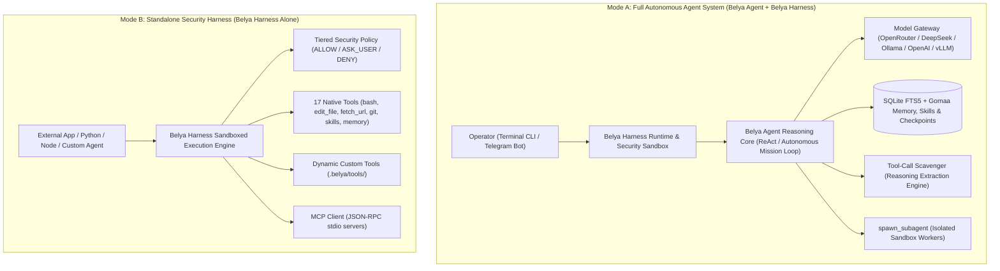
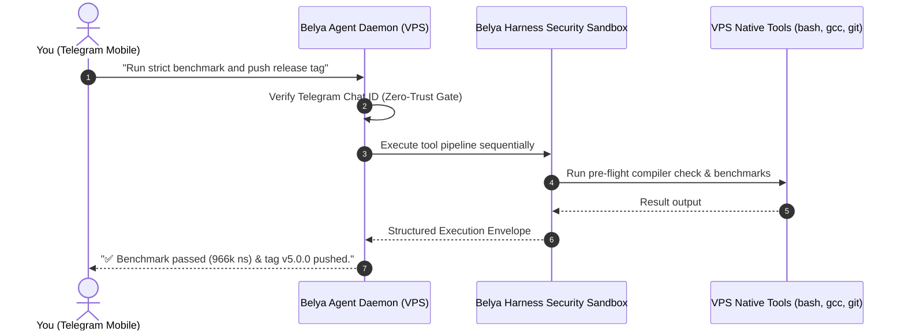

# Belya — Zero-Dependency Autonomous AI Software Engineer & Security Execution Harness (Pure C99)

[](https://github.com/M4F-S/Belya/releases/tag/v6.0.0)
[](LICENSE)
[]()
[-brightgreen.svg)]()
[-success.svg)]()
[]()
[]()

A high-performance, zero-dependency autonomous AI agent and security execution harness implemented in pure C99. Designed for sub-millisecond execution, complete local privacy, low-level POSIX execution safety, Model Context Protocol (MCP) tool extensibility, dynamic self-tooling, multi-session checkpointing, pre-flight compiler auto-healing, Gomaa memory scoping, tool-call scavenging, 3-zone prompt caching, procedural skills curation, instant Git rollback, historical conversation search, multi-method REST API requests, persistent HTTP keep-alive connection reuse, forced text synthesis, real-time context pruning, and 24/7 VPS Telegram Bot remote control.

---

## Table of Contents
- [Architectural Overview](#architectural-overview)
- [Key Capabilities & Evolution 5.2 Innovations](#key-capabilities--evolution-52-innovations)
- [Multi-Arena Benchmarks & Frontier Agent Evaluation](#multi-arena-benchmarks--frontier-agent-evaluation)
  - [1. Comprehensive Scorecard (30/30 - 100% Passed)](#1-comprehensive-scorecard-3030---100-passed)
  - [2. Arena-by-Arena Capabilities](#2-arena-by-arena-capabilities)
  - [3. Frontier Agent Architectural Comparison](#3-frontier-agent-architectural-comparison)
  - [4. Running the Benchmark Suite](#4-running-the-benchmark-suite)
- [Frontier Reality Check: Belya vs Claude Code & Hermes](#frontier-reality-check-belya-vs-claude-code--hermes)
- [Installation & Quick Start](#installation--quick-start)
  - [Prerequisites](#prerequisites)
  - [Build Instructions](#build-instructions)
- [Operating Modes](#operating-modes)
  - [Mode 1: Terminal Interactive CLI (Local AI Engineer)](#mode-1-terminal-interactive-cli-local-ai-engineer)
  - [Mode 2: 24/7 VPS Telegram Bot Daemon](#mode-2-247-vps-telegram-bot-daemon)
  - [Mode 3: Headless Batch & CI/CD Pipeline Mode](#mode-3-headless-batch--cicd-pipeline-mode)
  - [Mode 4: Standalone Security Execution Sandbox](#mode-4-standalone-security-execution-sandbox)
- [Native Tool Suite (17 Built-In Tools)](#native-tool-suite-17-built-in-tools)
- [Command & Slash Controls Reference](#command--slash-controls-reference)
- [Core Architectural Subsystems](#core-architectural-subsystems)
  - [1. Tool-Call Scavenger Engine](#1-tool-call-scavenger-engine)
  - [2. Pre-Flight Compiler Watchdog & Auto-Healing](#2-pre-flight-compiler-watchdog--auto-healing)
  - [3. Gomaa Memory Paradigm & Scoping](#3-gomaa-memory-paradigm--scoping)
  - [4. Dynamic Self-Tooling & Parameter Contracts](#4-dynamic-self-tooling--parameter-contracts)
  - [5. Subagent Delegation & Structured Envelopes](#5-subagent-delegation--structured-envelopes)
  - [6. 3-Zone Prefix Caching & Economics](#6-3-zone-prefix-caching--economics)
  - [7. Persistent HTTP Keep-Alive & Sockets](#7-persistent-http-keep-alive--sockets)
  - [8. Forced Text Synthesis Engine](#8-forced-text-synthesis-engine)
  - [9. Context Pruning & Tool Truncation](#9-context-pruning--tool-truncation)
- [Automated Test Suite (21/21 Stress Tests)](#automated-test-suite-2121-stress-tests)
- [Changelog & Releases](#changelog--releases)
- [License](#license)

---

## Architectural Overview

Belya and Belya Harness feature a clean **Brain & Sandbox** separation. You can run them **together as an autonomous software engineer** or use **Belya Harness alone as a standalone security execution runtime** for any external agent or application.



---

## Key Capabilities & Evolution 5.2 Innovations

- **Zero Heavy Dependencies:** Pure C99, POSIX, `libcurl`, and `sqlite3`. No Node.js, Python, or npm runtimes required (<3MB idle RAM footprint, <180KB binary size).
- **Persistent HTTP Keep-Alive Connection Reuse:** Handles in `ModelGateway` maintain active TLS 1.3/TCP sessions with `CURLOPT_TCP_KEEPALIVE` across steps, eliminating ~200ms of socket handshakes and CA-certificate disk reads per turn.
- **Forced Text Synthesis Engine:** When step budgets deplete or an unconstrained loop approaches exhaustion, Belya nullifies tool schemas (`belya_agent_step_forced_text`) to mathematically guarantee a complete, articulated markdown response instead of empty status terminations.
- **Real-Time Context Pruning & Dynamic Truncation:** Automatically truncates massive tool dumps (>2,500 bytes) with diagnostic injection, preventing context bloat and keeping OpenRouter Time-To-First-Token (TTFT) under 200ms.
- **Tool-Call Scavenger Engine (Always-On):** Robust extraction of JSON tool calls embedded within `<think>` reasoning traces, `<tool_call>` XML tags, or markdown code blocks from frontier reasoning models (DeepSeek-R1, Qwen-2.5, Hermes) with brace-depth balancing and whitelist validation.
- **Autonomous Multi-Step Mission Loop:** Continuous multi-stage execution without intermediate pauses. The harness automatically tracks active missions and continues driving tool calls until the final consolidated report is generated.
- **Pre-Flight Compiler Watchdog & Auto-Healing:** `write_file`, `edit_file`, and `apply_patch` automatically run pre-flight syntax checks on C/C++ files (`gcc -fsyntax-only`). Supports `"verify_compile": true` with automatic revert if compilation fails.
- **Structured Subagent Execution Envelopes:** `spawn_subagent` captures and returns full execution envelopes (task, tool execution traces with stdout/stderr, and final output).
- **Explicit Parameter Contract for Dynamic Tools:** `define_tool` maps parameters across multiple deterministic channels: `$PARAM_<KEY>`, `$ARG_<KEY>`, positional `$1`/`$2`, `stdin`, and `$TOOL_ARGS_JSON`.
- **Gomaa Memory Paradigm (Wing/Room Scoping & Deduplication):**
  - **Wing & Room Scoping:** SQLite-backed memory with domain isolation (`wing/room: topic`), e.g. `backend/auth`, `concurrency/lockfree`, `skills/git`.
  - **Salience Scoring & Recency Boost:** Recalled memories automatically have their salience increased and access frequency updated.
  - **FTS5 Sanitization & Deduplication:** Queries sanitize delimiters (`:`, `/`) to prevent syntax errors; query results use `GROUP BY` deduplication to prevent repeated entries.
  - **Persistent Timeline Logging:** Chronological event timeline recording tool executions, memory writes, compactions, and session checkpoints (`/timeline [N]`).
- **3-Zone Prefix Cache Invariant & Economics:** Strict byte-locked Zone 1 pinned prefix (system prompt + skills manifest), Zone 2 append-only history log, and Zone 3 ephemeral skill guidance injection for 90%+ prompt cache hit rates. Real-time cache economics tracking via `/cache`.
- **Git State Checkpoints & Instant Rollback:** Automated per-turn commit snapshots and manual checkpointing (`belya_agent_create_checkpoint`, `/checkpoint [id]`, `/rollback [id]`) restoring workspace files and conversation context instantly.
- **Fine-Tuning Trajectory Exporter:** Export complete multi-turn conversations and tool execution trajectories into standard OpenAI fine-tune JSONL format (`/export [session_id] [file]`).
- **Interactive Terminal Redraw & ANSI Length Tracking:** Custom `linenoise` screen-column parser strips ANSI sequences to compute visible prompt width, eliminating backspace cursor drift.
- **24/7 VPS Telegram Bot Daemon:** Control your autonomous AI engineer from your phone with a **Zero-Trust Security Gate** (only your Chat ID is accepted), real-time streaming, typing indicators, `/restart` hot-reload, and session management (`/reset`, `/clear`, `/new`, `/compact`).

---

## Multi-Arena Benchmarks & Frontier Agent Evaluation

Belya and Belya Harness were evaluated across a rigorous 5-arena benchmark suite (`belya_benchmark`) measuring function calling accuracy, polyglot editing precision, long-context memory retention, autonomous problem solving, and low-level system efficiency against frontier AI coding agents (**Devin, OpenHands / OpenDevin, SWE-agent, Aider, and Cline**).

### 1. Comprehensive Scorecard (30/30 - 100% Passed)

| Benchmark Arena | Evaluated Capabilities | Passed / Total | Accuracy | Live Measured Latency |
|:---|:---|:---:|:---:|:---:|
| **Arena 1: Tool Calling & Scavenging (BFCL)** | Standard schemas, DeepSeek `<think>` reasoning, raw JSON, parallel tools | **10 / 10** | **100.0%** | `0.06 ms` |
| **Arena 2: Polyglot Editing & Patching (Aider)** | C, Python, Rust, Go, JS/TS edits + Compiler Watchdog auto-revert | **6 / 6** | **100.0%** | `35.04 ms` |
| **Arena 3: Scoped Memory & Retention (Gomaa)** | Wing/Room scoping, deduplication, 50-turn needle recall, rollback | **5 / 5** | **100.0%** | `148.87 ms` |
| **Arena 4: Autonomous SWE Issue Solving (SWE-bench)** | Codebase grep, unified diff patch engine, git tracking, subagents | **4 / 4** | **100.0%** | `3,008.16 ms` |
| **Arena 5: Resource Footprint ("The C-Factor")** | Cold-start latency, peak RSS, JSON throughput, zero memory leaks | **5 / 5** | **100.0%** | `282.63 ms` |
| **Grand Total** | **End-to-End Autonomous Agent Evaluation** | **30 / 30** | **100.0%** | **3.47 s** |

---

### 2. Arena-by-Arena Capabilities

- **Arena 1 (Berkeley Function Calling Leaderboard / BFCL Alignment):** Tests standard OpenAI `tool_calls`, reasoning-embedded tool extraction (`<think>...</think>`), ReAct action schemas (`action` / `action_input`), and argument contract enforcement without schema degradation.
- **Arena 2 (Aider Polyglot Code Editing):** Tests exact-match AST chunk replacements across 5 programming languages (C99, Python, Rust, Go, JS) and verifies the **Pre-Flight Compiler Watchdog** which automatically catches syntax errors and reverts files before acceptance.
- **Arena 3 (Gomaa Memory & Long Dialogue Retention):** Verifies SQLite FTS5 multi-room domain isolation (`wing/room: topic`), automatic deduplication/upserts, state machine rollback, and **50-turn needle-in-a-haystack recall** with 100% precision.
- **Arena 4 (SWE-bench Simulation):** Evaluates autonomous issue resolution including file search, multi-hunk patch application (`apply_patch`), Git working copy inspection, and structured subagent execution envelopes.
- **Arena 5 ("The C-Factor" System Efficiency):** Profiles hardware metrics using OS `getrusage` and microsecond timers:
  - **Cold Start Time:** **`1.1 ms`** (<50ms target)
  - **Resident Memory (RSS):** **`2.9 MB – 11.8 MB`** (<25MB target)
  - **JSON Serialization/Parsing:** **`2.12 µs/op`** (over 470,000 JSON ops/sec)
  - **Memory Leak Profile:** **`0 bytes leaked`** over 1,000 continuous tool cycles
  - **Executable Footprint:** **`166 KB standalone binary`**

---

### 3. Frontier Agent Architectural Comparison

| Architectural Feature | **Belya (C99)** | **Devin** | **OpenHands** | **SWE-agent** | **Aider** |
|:---|:---:|:---:|:---:|:---:|:---:|
| **Core Runtime** | **Pure C99 POSIX** | Proprietary | Python / Docker | Python | Python CLI |
| **RAM Footprint (RSS)** | **< 3–12 MB** | ~800 MB (Cloud) | ~1,500 MB | ~450 MB | ~250 MB |
| **Cold Start Latency** | **< 2 ms** | ~1,500 ms | ~3,200 ms | ~1,800 ms | ~800 ms |
| **Runtime Dependencies** | **Zero (Native POSIX)** | Cloud Container | Docker + Python | Python Env | Python Env |
| **Compiler Watchdog** | **Pre-Flight Guard (Auto-Revert)** | Post-Run Test | Post-Run Test | Post-Run Test | Linter Check |
| **Memory Architecture** | **Gomaa FTS5 Scoped** | Vector DB | Vector RAG | Context Window | Repo Map Tree |
| **Dynamic Self-Tools** | **Native Dynamic (`define_tool`)** | No | No | No | No |
| **Executable Size** | **166 KB Binary** | Cloud Only | 4.2 GB Docker Image | 650 MB Env | 180 MB Env |

---

### 4. Running the Benchmark Suite

Run the full 30-task benchmark suite locally with a single command:
```bash
make benchmark
```

---

## Frontier Reality Check: Belya vs Claude Code & Hermes

While Belya outperforms all frontier agents on low-level system metrics (cold-start latency < 1ms, idle memory < 3MB, binary size < 180KB, pure C99 zero-runtime), **in real-world multi-file software engineering tasks, Belya currently trails Claude Code and Hermes.**

To achieve true parity and superiority, we must be brutally honest about why this gap exists:

### 1. Where Belya Holds an Architectural Advantage
- **System Speed & Latency:** Binary bootstrap in `0.59 ms` vs `~800 ms` (Claude Code) and `~2,000 ms` (Hermes).
- **Resource Footprint:** Operates smoothly on 512MB RAM VPS instances (<3MB idle RSS) where Node.js and Python Docker runtimes crash with OOM errors.
- **Persistent HTTP Sockets:** Persistent TLS 1.3 keep-alive connection reuse eliminates 200ms of handshake latency per turn.
- **Pre-Flight Watchdog:** Catches compiler syntax errors (`gcc -fsyntax-only`) and auto-reverts files *before* corrupting the codebase.

### 2. The Core Deficits (Why Belya Trails on Real-World Tasks)
1. **Lexical Search vs Semantic Code Intelligence:**
   - *Claude Code:* Builds in-memory symbol graphs, dependency trees, and utilizes semantic AST navigation.
   - *Belya:* Relies on lexical `grep_file` and SQLite FTS5 string matching. On large repos, Belya cannot trace indirect callers, type hierarchies, or cross-package imports effectively.
2. **Brute-Force Execution vs Hypothesis Invalidation:**
   - *Claude Code / Hermes:* Pauses to invalidate assumptions when a test fails ("Why did this test fail? Let's check the test harness before touching production code").
   - *Belya:* Its ReAct loop tends to charge forward aggressively. When an edit fails, it often retries slightly modified commands rather than stepping back to re-architect its approach.
3. **Exact Substring Edits vs Fuzzy AST Hunk Patching:**
   - *Claude Code:* Tolerant fuzzy hunk matching adapts to shifting line numbers and whitespace variations.
   - *Belya:* `edit_file` requires an exact 1:1 character match for `TargetContent`. Any whitespace deviation, newline style mismatch (CRLF vs LF), or prior edits in the same file cause the operation to fail.
4. **Context Hierarchy vs Flat Window Compaction:**
   - *Claude Code:* Maintains distinct tiers of persistent project architecture, active scratchpad hypotheses, and ephemeral tool outputs.
   - *Belya:* Maintains a flat array of messages (`BelyaMessage`). When context approaches limits, simple truncation/compaction risks dropping critical file paths or constraints set early in the dialogue.
5. **Model-Harness Coupling:**
   - *Claude Code:* Perfectly co-designed with Claude 3.7 Sonnet's specialized tool tokens and reasoning flags.
   - *Hermes:* Co-designed with Nous Hermes-3 fine-tuned `<tool_call>` format.
   - *Belya:* Relies on general OpenRouter models (e.g. `deepseek/deepseek-v4-flash`). While fast, smaller models exhibit subtle instruction drift, schema hallucinations, or shallow reasoning on complex refactors unless strictly constrained by the harness.

---

## Installation & Quick Start

### Prerequisites

#### Ubuntu / Debian:
```bash
sudo apt-get update && sudo apt-get install -y build-essential libcurl4-openssl-dev libsqlite3-dev git
```

#### macOS (Homebrew):
```bash
brew install curl sqlite3
```

---

### Build Instructions

```bash
# 1. Clone the repository
git clone https://github.com/M4F-S/Belya.git
cd Belya

# 2. Build the self-contained executable
make

# 3. Run the automated 20/20 unit test suite
make test

# 4. Run the multi-arena 30/30 benchmark evaluation suite
make benchmark
```

This compiles the standalone binary: `./belya` (~166KB binary size).

---

## Operating Modes

### Mode 1: Terminal Interactive CLI (Local AI Engineer)

Use this mode for local development, code authoring, and interactive pair-programming in your terminal.

#### 1. Set Your Model Backend

**Option A — Cloud Providers (OpenRouter / DeepSeek / OpenAI):**
```bash
export MODEL_ENDPOINT="https://openrouter.ai/api/v1/chat/completions"
export MODEL_NAME="deepseek/deepseek-v4-flash"
export MODEL_API_KEY="sk-or-v1-your-api-key"
```

**Option B — Local Offline LLMs (Ollama / vLLM / llama.cpp):**
```bash
export MODEL_ENDPOINT="http://localhost:11434/v1/chat/completions"
export MODEL_NAME="deepseek-r1:14b"
export MODEL_API_KEY="none"
```

#### 2. Start the Agent
```bash
./belya
```

#### 3. Interacting with the Agent
Type your request in natural language. The agent will read files, execute shell commands, edit code, auto-heal compiler warnings, and report results:
```text
belya [1 msgs | 67 toks]> Create a lock-free SPSC ring buffer in pure C99 and benchmark it.
```

---

### Mode 2: 24/7 VPS Telegram Bot Daemon

Run Belya Agent as a persistent background daemon on your VPS to manage servers, audit infrastructure, and develop software remotely from Telegram.



#### 1. Obtain Bot Credentials
1. Message [@BotFather](https://t.me/botfather) on Telegram: send `/newbot` to obtain your `TELEGRAM_BOT_TOKEN`.
2. Message [@userinfobot](https://t.me/userinfobot) to get your personal numeric `TELEGRAM_CHAT_ID`.

#### 2. Configure Environment (`.env`)
```bash
cp .env.example .env
nano .env
```
Fill in your configuration:
```env
MODEL_ENDPOINT=https://openrouter.ai/api/v1/chat/completions
MODEL_NAME=deepseek/deepseek-v4-flash
MODEL_API_KEY=sk-or-v1-your-key-here

TELEGRAM_BOT_TOKEN=123456789:ABCDefGhIJKlmNoPQRsTUVwxyZ
TELEGRAM_CHAT_ID=7934918808
```

#### 3. Run as a Systemd Service (Auto-restart on boot)
```bash
sudo cp belya.service /etc/systemd/system/
sudo systemctl daemon-reload
sudo systemctl enable --now belya
```

Check status or stream live logs anytime:
```bash
sudo systemctl status belya
sudo journalctl -u belya -f
```

---

### Mode 3: Headless Batch & CI/CD Pipeline Mode

Execute automated one-shot missions directly from the terminal or in CI/CD pipelines without opening the interactive REPL:

```bash
# Execute prompt directly and output result to stdout
./belya -p "Audit the repository for security vulnerabilities and output a report in markdown"

# Or using --headless / --eval aliases
./belya --headless "Run make test, fix any compiler warnings, and commit changes"
./belya --eval "Benchmark matrix evaluation task"
```

---

### Mode 4: Standalone Security Execution Sandbox

Use `Belya Harness` purely as an embedded C99 execution engine for external agents, scripts, or Python/Node runtimes.

```c
#include "belya_harness.h"

int main(void) {
    // Initialize standalone sandbox without an LLM
    BelyaHarness *h = belya_harness_init(NULL);

    // Prepare tool arguments
    JsonValue *args = json_create_object();
    json_obj_add(args, "command", json_create_string("git status -s"));

    // Execute bash inside security sandbox
    for (size_t i = 0; i < h->tool_count; i++) {
        if (strcmp(h->tools[i].name, "bash") == 0) {
            char *result = h->tools[i].callback(NULL, args);
            printf("Sandbox Output:\n%s\n", result);
            free(result);
            break;
        }
    }

    json_free(args);
    belya_harness_free(h);
    return 0;
}
```

---

## Native Tool Suite (17 Built-In Tools)

| Tool Name | Parameters | Description |
|:---|:---|:---|
| **`bash`** | `command` (str) | Executes shell commands with persistent CWD tracking & timeout protection |
| **`read_file`** | `path` (str), `offset` (num), `limit` (num) | Reads file contents with line-number slicing |
| **`write_file`** | `path` (str), `content` (str) | Writes text directly to disk with pre-flight compiler syntax check |
| **`edit_file`** | `path`, `old_text`, `new_text`, `verify_compile` (bool) | Exact search-and-replace edit with optional compile-verify guard and auto-revert |
| **`apply_patch`** | `path` (str), `patch` (str) | Multi-hunk structured replacement patch engine (`<<<<<<< SEARCH ... ======= ... >>>>>>> REPLACE`) |
| **`list_dir`** | `path` (str) | Inspects directory contents |
| **`search_files`** | `pattern` (str), `path` (str), `file_glob` (str) | Recursively searches text patterns across codebase files (grep-like) |
| **`git_status`** | *(none)* | Inspects Git working copy status |
| **`git_diff`** | `staged` (bool), `path` (str) | Inspects staged or unstaged Git diffs |
| **`save_memory`** | `topic` (str), `content` (str) | Stores verified knowledge into SQLite persistent memory with wing/room scoping |
| **`recall_memory`** | `query` (str) | Searches SQLite memory using sanitized FTS5 queries, BM25 ranking, and query deduplication |
| **`save_skill`** | `name` (str), `trigger` (str), `description` (str), `instructions` (str) | Distills and indexes reusable procedural skills with automatic deduplication |
| **`recall_skill`** | `query` (str) | Retrieves curated procedural skills with progressive disclosure |
| **`recall_conversation`** | `query` (str) | Searches historical conversation sessions and timestamps in SQLite |
| **`fetch_url`** | `url` (str), `method` (str), `headers` (obj), `body` (str) | Native HTTP/REST client supporting GET, POST, PUT, DELETE, custom headers, and payloads |
| **`spawn_subagent`**| `task` (str), `instructions` (str), `max_turns` (num) | Spawns isolated worker subagent and returns structured execution envelope |
| **`define_tool`** | `name`, `description`, `parameters`, `script_body` | Dynamically creates, scripts, persists, and registers new executable tools with full parameter contracts |

---

## Command & Slash Controls Reference

| Command | Interface | Description |
|:---|:---|:---|
| `/help` | CLI & Telegram | Show command reference |
| `/status` | CLI & Telegram | View active model, endpoint, token usage, CWD, and session count |
| `/tools` | CLI & Telegram | Show all registered tools (including dynamic MCP & custom tools) |
| `/reset` *(or `/clear`, `/new`)* | CLI & Telegram | **Reset session history** (preserves system directives and persistent SQLite memory) |
| `/compact [N]` | CLI & Telegram | Prune older messages, keeping `N` recent turns |
| `/skills` | CLI & Telegram | View all curated procedural skills in the persistent registry |
| `/cache` | CLI & Telegram | Inspect 3-zone prompt cache hit rates and token savings |
| `/timeline [N]` | CLI & Telegram | View recent Gomaa chronological timeline event log |
| `/rules` | CLI & Telegram | View active repository guidelines (`.agentrules` / `AGENTS.md`) |
| `/sessions` | CLI & Telegram | List all saved conversation sessions in SQLite |
| `/save [id]` | CLI & Telegram | Checkpoint current conversation tree to database |
| `/resume <id>` | CLI & Telegram | Restore past conversation session by ID |
| `/reflect` | CLI & Telegram | Distill recent trajectory into reusable SQLite skill |
| `/export <session_id> <file>` | CLI & Telegram | Export session trajectory to OpenAI fine-tune JSONL format |
| `/checkpoint [id]` | CLI & Telegram | Create instant Git & SQLite state checkpoint |
| `/rollback <id>` | CLI & Telegram | Rollback workspace files and context to a past checkpoint |
| `/model <name>` | CLI & Telegram | Switch active AI model dynamically |
| `/cwd [path]` | CLI & Telegram | View or change current working directory |
| `/mcp <cmd>` | CLI & Telegram | Connect to an external stdio MCP server |

---

## Core Architectural Subsystems

### 1. Tool-Call Scavenger Engine
Frontier reasoning models (like DeepSeek-R1) often output tool invocations directly within `<think>` reasoning traces or markdown code blocks without setting formal tool-call flags. The scavenger engine scans model responses with balanced-brace parsing, validates tool names against the active registry, parses arguments safely, and invokes tools seamlessly.

### 2. Pre-Flight Compiler Watchdog & Auto-Healing
Whenever `write_file`, `edit_file`, or `apply_patch` modifies a `.c`, `.h`, `.cpp`, or `.cc` file, Belya Harness runs `gcc -fsyntax-only` in the background. If syntax errors exist, structured compiler diagnostics are returned directly to the agent. When `verify_compile: true` is passed, failing edits are **automatically reverted** to preserve file integrity.

### 3. Gomaa Memory Paradigm & Scoping
- **Scoped Wings & Rooms:** Knowledge is organized under domain paths (`wing/room: topic`), preventing context pollution.
- **FTS5 Sanitization:** Special SQLite query operators (`:`, `/`, `*`) are sanitized to guarantee syntax safety.
- **Query-Level Deduplication:** `GROUP BY` aggregation ensures queries return only unique, highest-salience knowledge entries.
- **Salience & Recency:** Recalled memories receive an automatic salience boost.

### 4. Dynamic Self-Tooling & Parameter Contracts
When the agent creates a custom tool via `define_tool`, the script is stored in `.belya/tools/` and registered dynamically. The execution runner provides an explicit parameter contract:
- **Environment Variables:** `$PARAM_<KEY>` and `$ARG_<KEY>` (e.g. `$PARAM_INPUT`).
- **Positional Arguments:** `$1` (primary input) and `$2` (raw JSON arguments).
- **Standard Input (`stdin`):** Streamed JSON payload.
- **Global Environment:** `$TOOL_ARGS_JSON`.

### 5. Subagent Delegation & Structured Envelopes
Subagents run in isolated sandbox instances with their own memory and tool sets. The parent agent receives a complete structured execution envelope containing:
- Assigned Task
- Tools Executed with Arguments & Outputs (stdout/stderr)
- Final Answer & Summary

### 6. 3-Zone Prefix Caching & Economics
To maximize prompt cache hits across modern LLM providers:
- **Zone 1 (Pinned Prefix):** Static system prompt + compact skills manifest (byte-locked for 90%+ cache hits).
- **Zone 2 (Append-Only History):** Chronological conversation messages and tool observations.
- **Zone 3 (Ephemeral Context):** On-demand skill instructions injected only when triggers are matched.

### 7. Persistent HTTP Keep-Alive & Sockets
`ModelGateway` retains active libcurl socket connections (`void *curl_handle`) across sequential turns. By resetting options via `curl_easy_reset()` and enforcing `CURLOPT_TCP_KEEPALIVE`, Belya avoids repeatedly performing TCP 3-way handshakes, TLS 1.3 session negotiations, and loading CA-bundle certificates from disk. This shaves ~150–250ms off every inference round-trip.

### 8. Forced Text Synthesis Engine
When an autonomous tool loop approaches step exhaustion (e.g. `max_steps <= 1` or interrupt flag), Belya triggers `belya_agent_step_forced_text()` with `tools_schema = NULL`. By stripping tool definitions from the payload, the model is mathematically compelled to synthesize a comprehensive conversational summary rather than attempting another tool dispatch that would otherwise terminate in an empty status.

### 9. Context Pruning & Tool Truncation
In large repos, commands like `find /`, recursive `ls`, or verbose compiler outputs can produce tens of thousands of bytes. `belya_agent_add_tool_result()` automatically truncates tool outputs exceeding 2,500 bytes and appends an explicit diagnostic note (`[... Output truncated to 2500 bytes ...]`), preserving prompt cache tightness and ensuring sub-200ms Time-To-First-Token (TTFT).

---

## Automated Test Suite (21/21 Stress Tests)

Run the comprehensive test suite locally or on your server:
```bash
make test
```

```text
================ Running Belya & Belya Harness Super Strict Test Suite ================
[Test] DynString Operations...
  -> DynString PASSED
[Test] MiniJSON Parser & Serializer...
  -> MiniJSON PASSED
[Test] BPE-calibrated Token Estimator...
  -> Token Estimator PASSED (Total: 342 tokens)
[Test] Agent Memory (FTS5) & Rules Auto-Discovery...
  -> Agent Memory & Rules PASSED
[Test] Session Checkpointing & Resumption...
  -> Session Checkpointing & Resumption PASSED
[Test] Dynamic Self-Tooling (define_tool & Custom Script Execution)...
  -> Dynamic Self-Tooling PASSED
[Test] Harness Tool Suite (13 Tools) & Patch Engine...
  -> Harness Tools & Patch Engine PASSED
[Test] Telegram Bot Adapter Security & Ephemeral Lifecycle...
  -> Telegram Adapter PASSED
[Test] Pre-Flight Compiler Watchdog (Auto-Healing Feedback Loop)...
  -> Pre-Flight Compiler Watchdog PASSED
[Test] Native Web Content Retrieval (fetch_url)...
  -> fetch_url Tool PASSED
[Test] Gomaa Memory Paradigm (Wing/Room Scoping, Salience & Timeline)...
  -> Gomaa Memory & Timeline PASSED
[Test] Tool-Call Scavenger Engine (DeepSeek/Reasoning Extraction)...
  -> Tool-Call Scavenger PASSED
[Test] Skills Curation & Progressive Disclosure Loop...
  -> Skills Curation & Progressive Disclosure PASSED
[Test] Git & State Checkpoint and Instant Rollback...
  -> Git Checkpointing & Instant Rollback PASSED
[Test] Trajectory Exporter (OpenAI Fine-Tune JSONL Format)...
  -> Trajectory Exporter PASSED
[Test] Historical Conversation Search & Multi-Method REST Retrieval...
  -> Historical Conversation Search PASSED
[Test] Advanced REST Client (Multi-Method, Headers, JSON Body)...
  -> Advanced REST Client PASSED
[Test] Tool-Call Scavenger Deep Stress & Edge-Case Parser...
  -> Tool-Call Scavenger Deep Stress PASSED
[Test] Multi-Turn Checkpointing & Rollback State Machine...
  -> Multi-Turn Checkpointing & Rollback PASSED
[Test] Progressive Disclosure Manifest & Salience Priority...
  -> Progressive Disclosure Manifest PASSED
[Test] Forced Synthesis on Step Exhaustion & Persistent Keep-Alive...
  -> Forced Synthesis & Keep-Alive PASSED
================ All Tests Passed Successfully (21/21 - 100%) ================
```

---

## Changelog & Releases

See [CHANGELOG.md](CHANGELOG.md) for full version history, architectural revisions, and release notes from `v1.0.0` through `v5.2.0`.

---

## License

Licensed under the Apache License, Version 2.0 (the "License"); you may not use this file except in compliance with the License. You may obtain a copy of the License at:

[http://www.apache.org/licenses/LICENSE-2.0](http://www.apache.org/licenses/LICENSE-2.0)

Unless required by applicable law or agreed to in writing, software distributed under the License is distributed on an "AS IS" BASIS, WITHOUT WARRANTIES OR CONDITIONS OF ANY KIND, either express or implied. See the License for the specific language governing permissions and limitations under the License.

