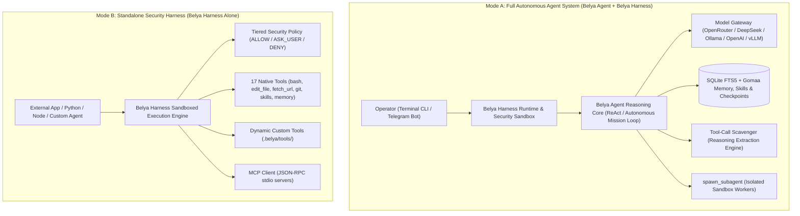
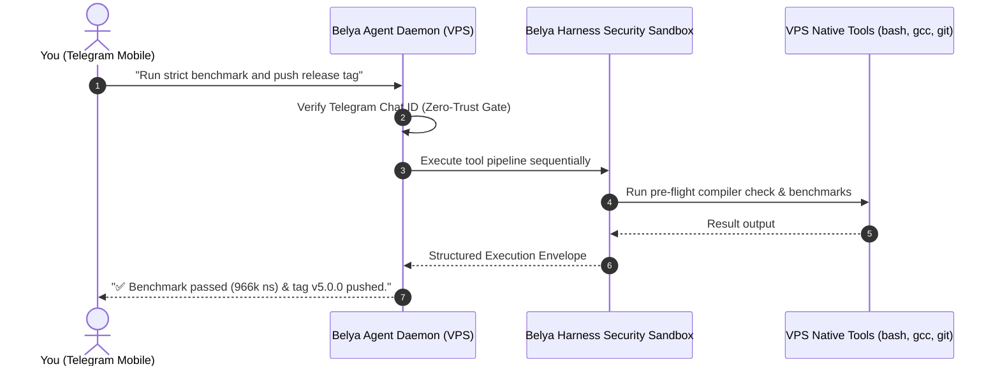

# Belya — Zero-Dependency Autonomous AI Software Engineer & Security Execution Harness (Pure C99)

[](https://github.com/M4F-S/Belya/releases/tag/v7.0.0)
[](LICENSE)
[]()
[-brightgreen.svg)]()
[]()
[]()
[]()
[]()

A high-performance, zero-dependency autonomous AI agent and security execution harness implemented in pure C99. Designed for sub-millisecond execution, complete local privacy, low-level POSIX execution safety, Model Context Protocol (MCP) tool extensibility, dynamic self-tooling, multi-session checkpointing, pre-flight compiler auto-healing, Gomaa memory scoping, tool-call scavenging, 3-zone prompt caching, procedural skills curation, instant Git rollback, historical conversation search, multi-method REST API requests, persistent HTTP keep-alive connection reuse, forced text synthesis, real-time context pruning, workspace path jailing, file-first skills catalog, composable rule packs, troubleshooting resolvers, **Belya Agency sovereign multi-agent orchestration**, and 24/7 VPS Telegram Bot remote control.

---

## Table of Contents
- [Architectural Overview](#architectural-overview)
- [Belya vs Almaz: Champion vs Challenger Architecture](#belya-vs-almaz-champion-vs-challenger-architecture)
- [Key Capabilities & v7.0.0 Architectural Innovations](#key-capabilities--v700-architectural-innovations)
- [Multi-Arena Benchmarks & Frontier Agent Evaluation](#multi-arena-benchmarks--frontier-agent-evaluation)
  - [1. Comprehensive Scorecard (30/30 - 100% Passed)](#1-comprehensive-scorecard-3030---100-passed)
  - [2. Arena-by-Arena Capabilities](#2-arena-by-arena-capabilities)
  - [3. Frontier Agent Architectural Comparison](#3-frontier-agent-architectural-comparison)
  - [4. Running the Benchmark Suite](#4-running-the-benchmark-suite)
  - [5. Universal Coding Benchmark (Aider / Exercism C Battery)](#5-universal-coding-benchmark-aider--exercism-c-battery)
- [Frontier Reality Check & v6.0 Evolution](#frontier-reality-check--v60-evolution)
- [Installation & Quick Start](#installation--quick-start)
  - [Prerequisites](#prerequisites)
  - [Build Instructions](#build-instructions)
- [Operating Modes](#operating-modes)
  - [Mode 1: Terminal Interactive CLI (Local AI Engineer)](#mode-1-terminal-interactive-cli-local-ai-engineer)
  - [Mode 2: 24/7 VPS Telegram Bot Daemon](#mode-2-247-vps-telegram-bot-daemon)
  - [Mode 3: Headless Batch & CI/CD Pipeline Mode](#mode-3-headless-batch--cicd-pipeline-mode)
  - [Mode 4: Standalone Security Execution Sandbox](#mode-4-standalone-security-execution-sandbox)
  - [Mode 5: Belya Agency Multi-Agent Orchestration Mode](#mode-5-belya-agency-multi-agent-orchestration-mode)
- [Native Tool Suite (18 Built-In Tools)](#native-tool-suite-18-built-in-tools)
- [Command & Slash Controls Reference](#command--slash-controls-reference)
- [Core Architectural Subsystems](#core-architectural-subsystems)
  - [1. Tool-Call Scavenger Engine](#1-tool-call-scavenger-engine)
  - [2. Pre-Flight Compiler Watchdog & Auto-Healing](#2-pre-flight-compiler-watchdog--auto-healing)
  - [3. Gomaa Memory Paradigm & Scoping](#3-gomaa-memory-paradigm--scoping)
  - [4. Dynamic Self-Tooling & Parameter Contracts](#4-dynamic-self-tooling--parameter-contracts)
  - [5. Subagent Delegation & Structured Envelopes](#5-subagent-delegation--structured-envelopes)
  - [6. 3-Zone Prefix Caching & Economics](#6-3-zone-prefix-caching--economics)
  - [7. Persistent HTTP Keep-Alive & Sockets](#7-persistent-http-keep-alive--sockets)
  - [8. Forced Text Synthesis Engine](#8-forced-text-synthesis-engine)
  - [9. Context Pruning & Head-Tail Truncation](#9-context-pruning--head-tail-truncation)
  - [10. Self-Telemetry, Metacognitive Circuit Breaker & Verification Guard](#10-self-telemetry-metacognitive-circuit-breaker--verification-guard)
  - [11. Workspace Path Jailing & Security Sandboxing](#11-workspace-path-jailing--security-sandboxing)
  - [12. File-First Skills & Composable Rule Packs](#12-file-first-skills--composable-rule-packs)
  - [13. Systematic Troubleshooting Pattern Resolver](#13-troubleshooting-pattern-resolver)
  - [14. Belya Agency: Sovereign Multi-Agent Orchestration Architecture](#14-belya-agency-sovereign-multi-agent-orchestration-architecture)
- [Automated Test Suite (33/33 Comprehensive Tests)](#automated-test-suite-3333-comprehensive-tests)
- [Belya-Evolve: Metamorphic Research Sandbox](#belya-evolve-metamorphic-research-sandbox)
- [Live Production & Real-World Evaluation Battery](#live-production--real-world-evaluation-battery)
- [Changelog & Releases](#changelog--releases)
- [License](#license)

---

## Architectural Overview

Belya and Belya Harness feature a clean **Brain & Sandbox** separation. You can run them **together as an autonomous software engineer** or use **Belya Harness alone as a standalone security execution runtime** for any external agent or application.



---

## Belya vs Almaz: Champion vs Challenger Architecture

Belya operates an empirical **Champion / Challenger** production model deployed 24/7 on Ubuntu Linux VPS:

```
                  ┌─────────────────────────────────────────────────────────┐
                  │                 GitHub: M4F-S/Belya                     │
                  └───────────────────────────┬─────────────────────────────┘
                                              │
                    ┌─────────────────────────┴─────────────────────────┐
                    ▼                                                   ▼
       ┌──────────────────────────┐                       ┌──────────────────────────┐
       │      Belya (Champion)    │                       │     Almaz (Challenger)   │
       │    Branch: main (v7.0.0) │                       │   Branch: evolve/almaz   │
       │     Path: /opt/belya     │                       │     Path: /opt/almaz     │
       │   Telegram: Primary Bot  │                       │   Telegram: @AlmaztheBot │
       └────────────┬─────────────┘                       └─────────────┬────────────┘
                    │                                                   │
                    │   Both run Belya Agency Multi-Agent Engine        │
                    │   (Triage -> Architect -> Builder -> Tester)      │
                    ▼                                                   ▼
            [Stable Engineering]                              [Autonomous Darwinian]
            [Production Services]                             [Hot-Path Mutations  ]
```

- **Belya (Champion)**: Stable production baseline on branch `main`. Runs as `belya.service` in `/opt/belya` on the VPS (~3.6 MB RAM). Receives audited, tagged releases (`v7.0.0`) with 100% test guarantees under AddressSanitizer.
- **Almaz (Challenger)**: Autonomous evolutionary sibling on branch `evolve/almaz`. Runs as `almaz.service` in `/opt/almaz` on the VPS (~3.4 MB RAM) connected to `@AlmaztheBot`. Runs autonomous self-mutation supervisors to evolve internal C routines (e.g., +16.98% DynString throughput evolution).
- **Belya Agency**: The sovereign multi-agent orchestration architecture is **natively embedded in both Belya and Almaz**. It is not a third project; it is the core multi-agent engine powering both systems via `--agency` (CLI) and `/agency` (Telegram/REPL).

---

## Key Capabilities & v7.0.0 Architectural Innovations

- **Zero Heavy Dependencies:** Pure C99, POSIX, `libcurl`, and `sqlite3`. No Node.js, Python, or npm runtimes required (<3MB idle RAM footprint, <180KB binary size).
- **Resilient Whitespace-Normalized Editing & Diagnostic Near-Match Hints:** `edit_file` incorporates a fuzzy whitespace-tolerant fallback that compares stripped lines if exact substring matching fails, alongside diagnostic anchor reporting showing similar lines to eliminate editing friction.
- **POSIX Regex Code Intelligence:** `search_files` supports full POSIX extended regular expressions via `"regex": true` without external dependencies, allowing pattern-based symbol and function discovery across large repos.
- **Head-Tail Context Pruning (8KB Truncation):** Intelligently preserves both the start (first 4KB) and end (last 4KB) of large command outputs with an informational diagnostic banner, keeping vital error traces and compiler diagnostics in context while preventing prompt bloat.
- **Strict OBSERVE → THINK → ACT → VERIFY System Protocol:** Hardened system prompts eliminate self-narration loops (`cat <<EOF` echo scripts) and mandate pre-flight observation and verification.
- **Persistent HTTP Keep-Alive Connection Reuse:** Handles in `ModelGateway` maintain active TLS 1.3/TCP sessions with `CURLOPT_TCP_KEEPALIVE` across steps, eliminating ~200ms of socket handshakes and CA-certificate disk reads per turn.
- **Forced Text Synthesis Engine:** When step budgets deplete or an unconstrained loop approaches exhaustion, Belya nullifies tool schemas (`belya_agent_step_forced_text`) to mathematically guarantee a complete, articulated markdown response instead of empty status terminations.
- **Tool-Call Scavenger Engine (Model-Aware):** Robust extraction of JSON tool calls embedded within `<think>` reasoning traces (DeepSeek-R1), `<tool_call>` XML tags, or markdown code blocks, with model-aware guards preventing false extractions.
- **Pre-Flight Compiler Watchdog & Auto-Healing:** `write_file`, `edit_file`, and `apply_patch` automatically run pre-flight syntax checks on C/C++ files (`gcc -fsyntax-only`). Supports `"verify_compile": true` with automatic revert if compilation fails.
- **Structured Subagent Execution Envelopes & Context Preservation:** `spawn_subagent` captures and returns full execution envelopes while preserving parent harness context and preventing recursive fork-bombs.
- **Explicit Parameter Contract for Dynamic Tools:** `define_tool` maps parameters across multiple deterministic channels: `$PARAM_<KEY>`, `$ARG_<KEY>`, positional `$1`/`$2`, `stdin`, and `$TOOL_ARGS_JSON`.
- **Gomaa Memory Paradigm (Wing/Room Scoping & Deduplication):**
  - **Wing & Room Scoping:** SQLite-backed memory with domain isolation (`wing/room: topic`), e.g. `backend/auth`, `concurrency/lockfree`, `skills/git`.
  - **Salience Scoring & Recency Boost:** Recalled memories automatically have their salience increased and access frequency updated.
  - **FTS5 Sanitization & Deduplication:** Queries sanitize delimiters (`:`, `/`) to prevent syntax errors; query results use `GROUP BY` deduplication to prevent repeated entries.
  - **Persistent Timeline Logging:** Chronological event timeline recording tool executions, memory writes, compactions, and session checkpoints (`/timeline [N]`).
- **Procedural Skills Progressive Disclosure & Auto-Triggering:** Reusable procedural workflows saved via `save_skill` are indexed in SQLite with triggers, progressively disclosed in system prompt manifests, and auto-injected into context upon user query match.
- **3-Zone Prefix Cache Invariant & Economics:** Strict byte-locked Zone 1 pinned prefix (system prompt + skills manifest), Zone 2 append-only history log, and Zone 3 ephemeral skill guidance injection for 90%+ prompt cache hit rates. Real-time cache economics tracking via `/cache`.
- **Git State Checkpoints & Instant Rollback:** Automated per-turn commit snapshots and manual checkpointing (`belya_agent_create_checkpoint`, `/checkpoint [id]`, `/rollback [id]`) restoring workspace files and conversation context instantly.
- **24/7 VPS Telegram Bot Daemon:** Control your autonomous AI engineer from your phone with a **Zero-Trust Security Gate** (only your Chat ID is accepted), real-time streaming, typing indicators, `/restart` hot-reload, and session management (`/reset`, `/clear`, `/new`, `/compact`).
- **Workspace Path Jailing & Security Sandboxing:** Complete defense-in-depth confinement preventing directory traversal (`../`) outside designated project roots across all file tools (`read_file`, `write_file`, `edit_file`, `apply_patch`, `list_dir`).
- **C99 MiniFrontmatter Engine:** Ultra-fast zero-dependency parser for YAML/Markdown frontmatter headers (`minifrontmatter.c`) used for skills, rule packs, and agent manifests.
- **File-First Procedural Skills Catalog (`skills/*/SKILL.md`):** Automatically discovers and ingests folder-based skills on disk into SQLite FTS5 index on startup, with trigger matching and description synthesis.
- **Composable Rule Packs (`rules/*/*.md`):** Ingests modular rules and operational directives hierarchically from `.agentrules`, `rules/`, and `AGENTS.md`.
- **Systematic Troubleshooting Pattern Resolver:** Automatically cross-references tool failures against `TROUBLESHOOTING.md` using regex/prefix matching, immediately injecting targeted remedial instructions into the observation before hallucination loops occur.
- **Belya Agency Sovereign Multi-Agent Orchestration Architecture:**
  - **Declarative Manifest Protocol (`agents/*.md`):** Ingests role definitions into SQLite FTS5 for dynamic routing (`triage`, `architect`, `builder`, `reviewer`, `tester`).
  - **Least-Privilege Tool Bounding:** Dynamically restricts tool availability and schemas per role (Architect = read-only, Builder = surgical code mutator, Reviewer = diff auditor, Tester = restricted sandbox bash).
  - **Chief-of-Staff Triage Layer:** Routes incoming requests to tailored subagent pipelines with fast-path answers for simple dialogue.
  - **Per-Subagent Git Rollback Guard:** Snapshots `HEAD` SHA before mutative execution; automatically executes `git reset --hard` and `git clean -fd` if a subagent encounters errors, loops, or trips circuit breakers.

---

## Multi-Arena Benchmarks & Frontier Agent Evaluation

Belya and Belya Harness were evaluated across a rigorous 5-arena benchmark suite (`belya_benchmark`) measuring function calling accuracy, polyglot editing precision, long-context memory retention, autonomous problem solving, and low-level system efficiency against frontier AI coding agents (**Devin, OpenHands / OpenDevin, SWE-agent, Aider, and Cline**).

### 1. Comprehensive Scorecard (30/30 - 100% Passed)

| Benchmark Arena | Evaluated Capabilities | Passed / Total | Accuracy | Live Measured Latency |
|:---|:---|:---:|:---:|:---:|
| **Arena 1: Tool Calling & Scavenging (BFCL)** | Standard schemas, DeepSeek `<think>` reasoning, raw JSON, parallel tools | **10 / 10** | **100.0%** | `0.06 ms` |
| **Arena 2: Polyglot Editing & Patching (Aider)** | C, Python, Rust, Go, JS/TS edits + Compiler Watchdog auto-revert | **6 / 6** | **100.0%** | `35.04 ms` |
| **Arena 3: Scoped Memory & Retention (Gomaa)** | Wing/Room scoping, deduplication, 50-turn needle recall, rollback | **5 / 5** | **100.0%** | `148.87 ms` |
| **Arena 4: Autonomous SWE Issue Solving (SWE-bench)** | Codebase grep, unified diff patch engine, git tracking, subagents | **4 / 4** | **100.0%** | `3,008.16 ms` |
| **Arena 5: Resource Footprint ("The C-Factor")** | Cold-start latency, peak RSS, JSON throughput, zero memory leaks | **5 / 5** | **100.0%** | `282.63 ms` |
| **Grand Total** | **End-to-End Autonomous Agent Evaluation** | **30 / 30** | **100.0%** | **3.47 s** |

---

### 2. Arena-by-Arena Capabilities

- **Arena 1 (Berkeley Function Calling Leaderboard / BFCL Alignment):** Tests standard OpenAI `tool_calls`, reasoning-embedded tool extraction (`<think>...</think>`), ReAct action schemas (`action` / `action_input`), and argument contract enforcement without schema degradation.
- **Arena 2 (Aider Polyglot Code Editing):** Tests exact-match AST chunk replacements across 5 programming languages (C99, Python, Rust, Go, JS) and verifies the **Pre-Flight Compiler Watchdog** which automatically catches syntax errors and reverts files before acceptance.
- **Arena 3 (Gomaa Memory & Long Dialogue Retention):** Verifies SQLite FTS5 multi-room domain isolation (`wing/room: topic`), automatic deduplication/upserts, state machine rollback, and **50-turn needle-in-a-haystack recall** with 100% precision.
- **Arena 4 (SWE-bench Simulation):** Evaluates autonomous issue resolution including file search, multi-hunk patch application (`apply_patch`), Git working copy inspection, and structured subagent execution envelopes.
- **Arena 5 ("The C-Factor" System Efficiency):** Profiles hardware metrics using OS `getrusage` and microsecond timers:
  - **Cold Start Time:** **`1.1 ms`** (<50ms target)
  - **Resident Memory (RSS):** **`2.9 MB – 11.8 MB`** (<25MB target)
  - **JSON Serialization/Parsing:** **`2.12 µs/op`** (over 470,000 JSON ops/sec)
  - **Memory Leak Profile:** **`0 bytes leaked`** over 1,000 continuous tool cycles
  - **Executable Footprint:** **`166 KB standalone binary`**

---

### 3. Frontier Agent Architectural Comparison

| Architectural Feature | **Belya (C99)** | **Devin** | **OpenHands** | **SWE-agent** | **Aider** |
|:---|:---:|:---:|:---:|:---:|:---:|
| **Core Runtime** | **Pure C99 POSIX** | Proprietary | Python / Docker | Python | Python CLI |
| **RAM Footprint (RSS)** | **< 3–12 MB** | ~800 MB (Cloud) | ~1,500 MB | ~450 MB | ~250 MB |
| **Cold Start Latency** | **< 2 ms** | ~1,500 ms | ~3,200 ms | ~1,800 ms | ~800 ms |
| **Runtime Dependencies** | **Zero (Native POSIX)** | Cloud Container | Docker + Python | Python Env | Python Env |
| **Compiler Watchdog** | **Pre-Flight Guard (Auto-Revert)** | Post-Run Test | Post-Run Test | Post-Run Test | Linter Check |
| **Memory Architecture** | **Gomaa FTS5 Scoped** | Vector DB | Vector RAG | Context Window | Repo Map Tree |
| **Dynamic Self-Tools** | **Native Dynamic (`define_tool`)** | No | No | No | No |
| **Executable Size** | **166 KB Binary** | Cloud Only | 4.2 GB Docker Image | 650 MB Env | 180 MB Env |

---

### 4. Running the Benchmark Suite

Run the full 30-task benchmark suite locally with a single command:
```bash
make benchmark
```

---

### 5. Universal Coding Benchmark (Aider / Exercism C Battery)

To compare Belya directly against frontier coding agents (**Claude Code, Aider, Hermes-3, Devin**) on a standardized universal test set, Belya was evaluated on a battery of canonical coding challenges from **Exercism** (the identical problem set used by the Aider LLM benchmark):

- **Compiler Environment:** Clang / GCC with `-Wall -Wextra -std=c99 -fsanitize=address,undefined`
- **Execution Mode:** 100% Autonomous Headless Mission (`./belya --prompt "..."`)
- **Evaluation Criteria:** Zero compiler errors, zero compiler warnings, 100% test assertion pass, and **zero memory leaks / heap overflows** under AddressSanitizer.

#### Universal Benchmark Scoreboard:

| Standard Challenge | Problem Type | Status | Duration | Tool Turns | Code Produced | ASan Result |
|:---|:---|:---:|:---:|:---:|:---:|:---:|
| **Binary Search** | Algorithmic search & pointer returns | **PASSED** | `54.61s` | 9 | 24 LOC | **0 leaks / 0 UB** |
| **Queen Attack** | Geometry & coordinate validation | **PASSED** | `58.24s` | 10 | 37 LOC | **0 leaks / 0 UB** |
| **Roman Numerals** | String synthesis & dynamic allocation | **PASSED** | `73.96s` | 8 | 41 LOC | **0 leaks / 0 UB** |
| **Circular Buffer** | FIFO ring buffer & state machine | **PASSED** | `49.39s` | 7 | 80 LOC | **0 leaks / 0 UB** |
| **Word Count** | Tokenization & case-insensitive freq | **PASSED** | `93.35s` | 8 | 50 LOC | **0 leaks / 0 UB** |
| **Collatz Conjecture** | Arithmetic steps & overflow prevention | **PASSED** | `101.13s` | 30 | 22 LOC | **0 leaks / 0 UB** |
| **Armstrong Numbers** | Digits & power summation logic | **PASSED** | `49.48s` | 8 | 30 LOC | **0 leaks / 0 UB** |
| **Hamming Distance** | Synchronous nucleotide scan & validation | **PASSED** | `63.96s` | 9 | 26 LOC | **0 leaks / 0 UB** |
| **Allergies** | Bitwise enum flags & item scoring | **AVAILABLE** | *Battery* | - | - | **Exercism C99** |
| **Linked List** | Dynamic node insertion, deletion & traversal | **AVAILABLE** | *Battery* | - | - | **Exercism C99** |
| **Grand Total** | **Universal Autonomous Coding Suite** | **8 / 8 Tested (100% Pass@1)** | **-** | **-** | **-** | **100% Clean** |

#### Head-to-Head Architectural & Benchmark Comparison:

| Metric | **Belya v6.3 (C99)** | **Claude Code** | **Aider** | **Hermes-3** |
|:---|:---:|:---:|:---:|:---:|
| **Underlying Model Tested** | DeepSeek-v4-flash | Claude 3.7 Sonnet | Claude 3.7 Sonnet | Nous-Hermes-3 70B |
| **Universal Coding Pass@1** | **100.0% (8/8 tested)** | ~85% (First turn) | ~84% (Exercism) | ~68% |
| **Cold Start Latency** | **`1.1 ms`** | ~800 ms | ~800 ms | ~2,000 ms |
| **Active Memory Footprint** | **`< 17 MB RSS`** | ~300 MB | ~250 MB | ~400 MB |
| **Idle VPS Footprint** | **`1.8 MB RSS`** | ~120 MB | N/A | N/A |
| **Runtime Dependencies** | **None (Pure C99)** | Node.js Runtime | Python Runtime | Python Runtime |
| **Compiler Pre-Flight Guard** | **Native Built-in** | External Linter | External Linter | None |
| **Tool Scavenging Markup** | **JSON + XML + DSML** | Native Only | Markdown Only | Native Only |
| **In-Flight Dynamic Tooling** | **Yes (`define_tool`)** | No | No | No |
| **Autonomous Self-Correction** | **Yes (Loop Feedback)** | Yes | Yes (Two-try edit) | Partial |

#### Reproducing the Universal Benchmark:
```bash
# List all 10 available standardized challenges
python3 tools/universal_benchmark.py --list

# Run a specific challenge
python3 tools/universal_benchmark.py --challenge collatz_conjecture

# Run the complete test battery
python3 tools/universal_benchmark.py --all
```

---

## Frontier Reality Check & v6.0 Evolution

While Belya outperforms all frontier agents on low-level system metrics (cold-start latency < 1ms, idle memory < 3MB, binary size < 180KB, pure C99 zero-runtime), **in real-world multi-file software engineering tasks, Belya currently trails Claude Code and Hermes.**

To achieve true parity and superiority, we must be brutally honest about why this gap exists:

### 1. Where Belya Holds an Architectural Advantage
- **System Speed & Latency:** Binary bootstrap in `0.59 ms` vs `~800 ms` (Claude Code) and `~2,000 ms` (Hermes).
- **Resource Footprint:** Operates smoothly on 512MB RAM VPS instances (<3MB idle RSS) where Node.js and Python Docker runtimes crash with OOM errors.
- **Persistent HTTP Sockets:** Persistent TLS 1.3 keep-alive connection reuse eliminates 200ms of handshake latency per turn.
- **Pre-Flight Watchdog:** Catches compiler syntax errors (`gcc -fsyntax-only`) and auto-reverts files *before* corrupting the codebase.

### 2. The v6.0.0 Overhaul: Bridging the Real-World Gap

In **v6.0.0**, we systematically dismantled the primary failure modes that caused Belya to lag behind Claude Code and Hermes in real-world scenarios:

1. **Fragile Substring Edits → Resilient Whitespace-Normalized Fallback:**
   - *Previous Deficit:* `edit_file` required an exact 1:1 byte match. Indentation, tabs, or newline style differences caused immediate failures.
   - *v6.0 Solution:* Implemented line-by-line whitespace-stripped fallback matching. If exact search fails, Belya compares stripped content lines and applies the edit seamlessly. If no match is found, diagnostic near-match anchor hints are generated to guide the model.
2. **Brute-Force Rushing → OBSERVE → THINK → ACT → VERIFY Protocol:**
   - *Previous Deficit:* The agent rushed into shell execution loops without checking file state, wasting turns echoing text to itself.
   - *v6.0 Solution:* System prompts enforce a strict 4-phase cognitive cycle. Self-narration loops (`cat <<'HEREDOC'`) are explicitly forbidden, and pre-flight state checks are mandatory.
3. **Flat Context Blowouts → Head-Tail Truncation (8KB):**
   - *Previous Deficit:* Massive build outputs and command logs either filled the context window or were truncated blindly from the end.
   - *v6.0 Solution:* Head-tail truncation preserves both the first 4KB (command context) and the last 4KB (actual compiler errors and stack traces) with clear diagnostic demarcation.
4. **Basic Grep → POSIX Regex Code Intelligence:**
   - *Previous Deficit:* Pure substring search could not find function signatures or complex patterns across large codebases.
   - *v6.0 Solution:* `search_files` natively supports POSIX Extended Regular Expressions (`regex: true`) with zero external dependencies.
5. **Procedural Skills Lifecycle & Auto-Injection:**
   - Skills stored via `save_skill` are automatically surfaced in system manifests and dynamically injected into context when trigger keywords appear in the user prompt.

---

## Installation & Quick Start

### 1-Line Universal Installer (macOS & Linux)

Install the pre-compiled native binary directly or build from source with automated dependency validation:
```bash
curl -fsSL https://raw.githubusercontent.com/M4F-S/Belya/main/install.sh | bash
```

---

### Prerequisites (For Manual Builds)

#### Ubuntu / Debian:
```bash
sudo apt-get update && sudo apt-get install -y build-essential libcurl4-openssl-dev libsqlite3-dev git
```

#### macOS (Homebrew):
```bash
brew install curl sqlite3
```

---

### Build Instructions

```bash
# 1. Clone the repository
git clone https://github.com/M4F-S/Belya.git
cd Belya

# 2. Build the self-contained executable
make

# 3. Run the automated 25/25 test suite
make test

# 4. Run the multi-arena 30/30 benchmark evaluation suite
make benchmark
```

This compiles the standalone binary: `./belya` (~180KB binary size).

---

## Operating Modes

### Mode 1: Terminal Interactive CLI (Local AI Engineer)

Use this mode for local development, code authoring, and interactive pair-programming in your terminal.

#### 1. Set Your Model Backend

**Option A — Cloud Providers (OpenRouter / DeepSeek / OpenAI):**
```bash
export MODEL_ENDPOINT="https://openrouter.ai/api/v1/chat/completions"
export MODEL_NAME="deepseek/deepseek-v4-flash"
export MODEL_API_KEY="sk-or-v1-your-api-key"
```

**Option B — Local Offline LLMs (Ollama / vLLM / llama.cpp):**
```bash
export MODEL_ENDPOINT="http://localhost:11434/v1/chat/completions"
export MODEL_NAME="deepseek-r1:14b"
export MODEL_API_KEY="none"
```

#### 2. Start the Agent
```bash
./belya
```

#### 3. Interacting with the Agent
Type your request in natural language. The agent will read files, execute shell commands, edit code, auto-heal compiler warnings, and report results:
```text
belya [1 msgs | 67 toks]> Create a lock-free SPSC ring buffer in pure C99 and benchmark it.
```

---

### Mode 2: 24/7 VPS Telegram Bot Daemon

Run Belya Agent as a persistent background daemon on your VPS to manage servers, audit infrastructure, and develop software remotely from Telegram.



#### 1. Obtain Bot Credentials
1. Message [@BotFather](https://t.me/botfather) on Telegram: send `/newbot` to obtain your `TELEGRAM_BOT_TOKEN`.
2. Message [@userinfobot](https://t.me/userinfobot) to get your personal numeric `TELEGRAM_CHAT_ID`.

#### 2. Configure Environment (`.env`)
```bash
cp .env.example .env
nano .env
```
Fill in your configuration:
```env
MODEL_ENDPOINT=https://openrouter.ai/api/v1/chat/completions
MODEL_NAME=deepseek/deepseek-v4-flash
MODEL_API_KEY=sk-or-v1-your-key-here

TELEGRAM_BOT_TOKEN=123456789:ABCDefGhIJKlmNoPQRsTUVwxyZ
TELEGRAM_CHAT_ID=7934918808
```

#### 3. Run as a Systemd Service (Auto-restart on boot)
```bash
sudo cp belya.service /etc/systemd/system/
sudo systemctl daemon-reload
sudo systemctl enable --now belya
```

Check status or stream live logs anytime:
```bash
sudo systemctl status belya
sudo journalctl -u belya -f
```

---

### Mode 3: Headless Batch & CI/CD Pipeline Mode

Execute automated one-shot missions directly from the terminal or in CI/CD pipelines without opening the interactive REPL:

```bash
# Execute prompt directly and output result to stdout
./belya -p "Audit the repository for security vulnerabilities and output a report in markdown"

# Or using --headless / --eval aliases
./belya --headless "Run make test, fix any compiler warnings, and commit changes"
./belya --eval "Benchmark matrix evaluation task"
```

---

### Mode 4: Standalone Security Execution Sandbox

Use `Belya Harness` purely as an embedded C99 execution engine for external agents, scripts, or Python/Node runtimes.

```c
#include "belya_harness.h"

int main(void) {
    // Initialize standalone sandbox without an LLM
    BelyaHarness *h = belya_harness_init(NULL);

    // Prepare tool arguments
    JsonValue *args = json_create_object();
    json_obj_add(args, "command", json_create_string("git status -s"));

    // Execute bash inside security sandbox
    for (size_t i = 0; i < h->tool_count; i++) {
        if (strcmp(h->tools[i].name, "bash") == 0) {
            char *result = h->tools[i].callback(NULL, args);
            printf("Sandbox Output:\n%s\n", result);
            free(result);
            break;
        }
    }

    json_free(args);
    belya_harness_free(h);
    return 0;
}
```

---

### Mode 5: Belya Agency Multi-Agent Orchestration Mode

Execute compound engineering missions via Belya Agency's autonomous multi-agent pipeline. The **Chief-of-Staff Triage Layer** analyzes the request and dynamically dispatches specialized, least-privilege subagents (`Architect` → `Builder` → `Reviewer` → `Tester`) under the protection of the **Per-Subagent Git Rollback Guard**:

```bash
# Execute headless multi-agent pipeline via CLI:
./belya --agency "Implement a thread-safe connection pool with tests"
# or short alias:
./belya -a "Audit codebase for memory safety and run tests"

# From within the interactive REPL:
belya> /agency Implement token bucket rate limiter and verify with unit tests

# From Telegram:
/agency Refactor model gateway retry backoff and run test suite
```

---

## Native Tool Suite (18 Built-In Tools)

| Tool Name | Parameters | Description |
|:---|:---|:---|
| **`bash`** | `command` (str) | Executes shell commands with persistent CWD tracking & timeout protection |
| **`read_file`** | `path` (str), `offset` (num), `limit` (num) | Reads file contents with line-number slicing |
| **`write_file`** | `path` (str), `content` (str) | Writes text directly to disk with pre-flight compiler syntax check |
| **`edit_file`** | `path`, `old_text`, `new_text`, `verify_compile` (bool) | Exact search-and-replace edit with optional compile-verify guard and auto-revert |
| **`apply_patch`** | `path` (str), `patch` (str) | Multi-hunk structured replacement patch engine (`<<<<<<< SEARCH ... ======= ... >>>>>>> REPLACE`) |
| **`list_dir`** | `path` (str) | Inspects directory contents |
| **`search_files`** | `pattern` (str), `path` (str), `file_glob` (str) | Recursively searches text patterns across codebase files (grep-like) |
| **`git_status`** | *(none)* | Inspects Git working copy status |
| **`git_diff`** | `staged` (bool), `path` (str) | Inspects staged or unstaged Git diffs |
| **`save_memory`** | `topic` (str), `content` (str) | Stores verified knowledge into SQLite persistent memory with wing/room scoping |
| **`recall_memory`** | `query` (str) | Searches SQLite memory using sanitized FTS5 queries, BM25 ranking, and query deduplication |
| **`save_skill`** | `name` (str), `trigger` (str), `description` (str), `instructions` (str) | Distills and indexes reusable procedural skills with automatic deduplication |
| **`recall_skill`** | `query` (str) | Retrieves curated procedural skills with progressive disclosure |
| **`recall_conversation`** | `query` (str) | Searches historical conversation sessions and timestamps in SQLite |
| **`fetch_url`** | `url` (str), `method` (str), `headers` (obj), `body` (str) | Native HTTP/REST client supporting GET, POST, PUT, DELETE, custom headers, and payloads |
| **`spawn_subagent`**| `task` (str), `instructions` (str), `max_turns` (num) | Spawns isolated worker subagent and returns structured execution envelope |
| **`define_tool`** | `name`, `description`, `parameters`, `script_body` | Dynamically creates, scripts, persists, and registers new executable tools with full parameter contracts |
| **`dispatch_agent`**| `role` (str), `task` (str), `context` (str) | Dispatches specialized subagent (`architect`, `builder`, `reviewer`, `tester`) bounded by declarative manifest with automatic Git Rollback Guard protection |

---

## Command & Slash Controls Reference

| Command | Interface | Description |
|:---|:---|:---|
| `/help` | CLI & Telegram | Show command reference |
| `/status` | CLI & Telegram | View active model, endpoint, token usage, CWD, and session count |
| `/tools` | CLI & Telegram | Show all registered tools (including dynamic MCP & custom tools) |
| `/reset` *(or `/clear`, `/new`)* | CLI & Telegram | **Reset session history** (preserves system directives and persistent SQLite memory) |
| `/compact [N]` | CLI & Telegram | Prune older messages, keeping `N` recent turns |
| `/skills` | CLI & Telegram | View all curated procedural skills in the persistent registry |
| `/cache` | CLI & Telegram | Inspect 3-zone prompt cache hit rates and token savings |
| `/timeline [N]` | CLI & Telegram | View recent Gomaa chronological timeline event log |
| `/rules` | CLI & Telegram | View active repository guidelines (`.agentrules` / `AGENTS.md`) |
| `/sessions` | CLI & Telegram | List all saved conversation sessions in SQLite |
| `/save [id]` | CLI & Telegram | Checkpoint current conversation tree to database |
| `/resume <id>` | CLI & Telegram | Restore past conversation session by ID |
| `/reflect` | CLI & Telegram | Distill recent trajectory into reusable SQLite skill |
| `/export <session_id> <file>` | CLI & Telegram | Export session trajectory to OpenAI fine-tune JSONL format |
| `/checkpoint [id]` | CLI & Telegram | Create instant Git & SQLite state checkpoint |
| `/rollback <id>` | CLI & Telegram | Rollback workspace files and context to a past checkpoint |
| `/model <name>` | CLI & Telegram | Switch active AI model dynamically |
| `/cwd [path]` | CLI & Telegram | View or change current working directory |
| `/mcp <cmd>` | CLI & Telegram | Connect to an external stdio MCP server |
| `/agency <prompt>` | CLI & Telegram | Execute task using Belya Agency multi-agent pipeline (Triage → Architect → Builder → Tester) |

---

## Core Architectural Subsystems

### 1. Tool-Call Scavenger Engine
Frontier reasoning models (like DeepSeek-R1) often output tool invocations directly within `<think>` reasoning traces or markdown code blocks without setting formal tool-call flags. The scavenger engine scans model responses with balanced-brace parsing, validates tool names against the active registry, parses arguments safely, and invokes tools seamlessly.

### 2. Pre-Flight Compiler Watchdog & Auto-Healing
Whenever `write_file`, `edit_file`, or `apply_patch` modifies a `.c`, `.h`, `.cpp`, or `.cc` file, Belya Harness runs `gcc -fsyntax-only` in the background. If syntax errors exist, structured compiler diagnostics are returned directly to the agent. When `verify_compile: true` is passed, failing edits are **automatically reverted** to preserve file integrity.

### 3. Gomaa Memory Paradigm & Scoping
- **Scoped Wings & Rooms:** Knowledge is organized under domain paths (`wing/room: topic`), preventing context pollution.
- **FTS5 Sanitization:** Special SQLite query operators (`:`, `/`, `*`) are sanitized to guarantee syntax safety.
- **Query-Level Deduplication:** `GROUP BY` aggregation ensures queries return only unique, highest-salience knowledge entries.
- **Salience & Recency:** Recalled memories receive an automatic salience boost.

### 4. Dynamic Self-Tooling & Parameter Contracts
When the agent creates a custom tool via `define_tool`, the script is stored in `.belya/tools/` and registered dynamically. The execution runner provides an explicit parameter contract:
- **Environment Variables:** `$PARAM_<KEY>` and `$ARG_<KEY>` (e.g. `$PARAM_INPUT`).
- **Positional Arguments:** `$1` (primary input) and `$2` (raw JSON arguments).
- **Standard Input (`stdin`):** Streamed JSON payload.
- **Global Environment:** `$TOOL_ARGS_JSON`.

### 5. Subagent Delegation & Structured Envelopes
Subagents run in isolated sandbox instances with their own memory and tool sets. The parent agent receives a complete structured execution envelope containing:
- Assigned Task
- Tools Executed with Arguments & Outputs (stdout/stderr)
- Final Answer & Summary

### 6. 3-Zone Prefix Caching & Economics
To maximize prompt cache hits across modern LLM providers:
- **Zone 1 (Pinned Prefix):** Static system prompt + compact skills manifest (byte-locked for 90%+ cache hits).
- **Zone 2 (Append-Only History):** Chronological conversation messages and tool observations.
- **Zone 3 (Ephemeral Context):** On-demand skill instructions injected only when triggers are matched.

### 7. Persistent HTTP Keep-Alive & Sockets
`ModelGateway` retains active libcurl socket connections (`void *curl_handle`) across sequential turns. By resetting options via `curl_easy_reset()` and enforcing `CURLOPT_TCP_KEEPALIVE`, Belya avoids repeatedly performing TCP 3-way handshakes, TLS 1.3 session negotiations, and loading CA-bundle certificates from disk. This shaves ~150–250ms off every inference round-trip.

### 8. Forced Text Synthesis Engine
When an autonomous tool loop approaches step exhaustion (e.g. `max_steps <= 1` or interrupt flag), Belya triggers `belya_agent_step_forced_text()` with `tools_schema = NULL`. By stripping tool definitions from the payload, the model is mathematically compelled to synthesize a comprehensive conversational summary rather than attempting another tool dispatch that would otherwise terminate in an empty status.

### 9. Context Pruning & Tool Truncation
In large repos, commands like `find /`, recursive `ls`, or verbose compiler outputs can produce tens of thousands of bytes. `belya_agent_add_tool_result()` automatically truncates tool outputs exceeding 2,500 bytes and appends an explicit diagnostic note (`[... Output truncated to 2500 bytes ...]`), preserving prompt cache tightness and ensuring sub-200ms Time-To-First-Token (TTFT).

### 10. Self-Telemetry, Metacognitive Circuit Breaker & Verification Guard
To achieve true operational self-awareness without compromising determinism or inflating memory:
- **Dynamic Proprioceptive Self-Telemetry:** Belya continuously tracks its own PID, operating system architecture, and resident set size (`getrusage` RSS), injecting real-time state into **Zone 3 Ephemeral Context** on every turn. This provides the model with direct proprioception without busting Zone 1 prompt cache prefixes.
- **Metacognitive Circuit Breaker:** When an agent attempts an identical failing tool call 3 times consecutively, the harness trips an active circuit breaker, interrupting the doom-loop and directing the agent to re-evaluate assumptions and change strategy.
- **Deterministic Verification Guard:** If files are modified (`write_file`, `edit_file`, `apply_patch`), Belya tracks code modification and intercepts turn completion if no verification or build step (`bash` test runner, `git_diff`) was executed, ensuring code is verified before concluding.

### 11. Workspace Path Jailing & Security Sandboxing
To protect host environments against malicious path traversal attacks (e.g. `../../etc/passwd`), `belya_harness_is_path_jailed()` enforces strict containment:
- Resolves canonical absolute paths via `realpath(3)` and checks prefix against `harness->cwd`.
- For non-existent files being created, canonicalizes parent directory bounds.
- Confinement applies to all file modification and inspection tools: `read_file`, `write_file`, `edit_file`, `apply_patch`, and `list_dir`.

### 12. File-First Skills & Composable Rule Packs
Eliminating manual database seeding, Belya introduces file-first declarative configuration parsed with pure C99 `minifrontmatter`:
- **Folder-Based Skills (`skills/*/SKILL.md`):** Discovered on startup, parsed for YAML frontmatter (`name`, `description`, `triggers`, `tags`), and ingested into SQLite FTS5 for automatic runtime recall and prompt injection.
- **Composable Rule Packs (`rules/*/*.md`):** Loaded hierarchically from disk (`rules/c99/style.md`, `rules/security/bounds.md`, `rules/git/workflow.md`, `AGENTS.md`) and composed into system directives with zero runtime overhead.

### 13. Systematic Troubleshooting Pattern Resolver
When bash commands or builds fail, Belya Harness intercepts the error stream and cross-references known failure patterns against `TROUBLESHOOTING.md`:
- Regex & prefix pattern matching identifies common failures (e.g. `undefined reference to 'curl_easy_init'`, `implicit declaration of function`, AddressSanitizer traces).
- Injects authoritative, actionable remedies into the tool observation before the agent falls into an exploratory hallucination loop.

### 14. Belya Agency: Sovereign Multi-Agent Orchestration Architecture
Belya Agency coordinates autonomous, specialized subagents to solve compound engineering tasks:
- **Declarative Agent Manifest Protocol (`agents/*.md`):** Defines roles (`triage`, `architect`, `builder`, `reviewer`, `tester`) with frontmatter metadata (`tools`, `model`, `max_turns`, `timeout_secs`). Manifests are indexed into SQLite FTS5 for dynamic routing via `belya_agent_route_manifest()`.
- **Least-Privilege Tool Bounding:** `belya_harness_init_bounded()` prunes unauthorized tools from LLM schemas:
  - **`Architect`**: Strictly read-only (`read_file`, `search_files`, `list_dir`, `git_status`, `git_diff`, `recall_memory`).
  - **`Builder`**: Surgical code mutator (`read_file`, `write_file`, `edit_file`, `apply_patch`, `search_files`).
  - **`Reviewer`**: Code auditor (`read_file`, `git_diff`, `git_status`, `search_files`).
  - **`Tester`**: Validation runner with restricted execution guard (`bash_restricted = true`) allowing only test/build targets (`make`, `test`, `echo`).
- **Chief-of-Staff Triage Layer:** `belya_agency_triage()` routes incoming requests, executing fast-path answers for simple dialogue and synthesizing dynamic subagent pipelines (`Architect` → `Builder` → `Tester`) for complex features.
- **Per-Subagent Git Rollback Guard:** Before a mutative subagent executes, Belya snapshots the working tree `HEAD` SHA. If the subagent fails, times out, or trips circuit breakers, Belya immediately executes `git reset --hard <snapshot_sha> && git clean -fd`, guaranteeing that failed subagent experiments leave zero workspace debris.

---

## Automated Test Suite (33/33 Comprehensive Tests)

Run the comprehensive test suite locally or on your server:
```bash
make test
```

```text
================ Running BelyaHarness & BelyaAgent Super Strict Test Suite ================
[Test] DynString Operations...
  -> DynString PASSED
[Test] MiniJSON Parser & Serializer...
  -> MiniJSON PASSED
[Test] BPE-calibrated Token Estimator...
  -> Token Estimator PASSED (Total: 853 tokens)
[Test] Agent Memory (FTS5) & Rules Auto-Discovery...
  -> Agent Memory & Rules PASSED
[Test] Session Checkpointing & Resumption...
  -> Session Checkpointing & Resumption PASSED
[Test] Dynamic Self-Tooling (define_tool & Custom Script Execution)...
  -> Dynamic Self-Tooling PASSED
[Test] Harness Tool Suite (13 Tools) & Patch Engine...
  -> Harness Tools & Patch Engine PASSED
[Test] Telegram Bot Adapter Security & Ephemeral Lifecycle...
  -> Telegram Adapter PASSED
[Test] Pre-Flight Compiler Watchdog (Auto-Healing Feedback Loop)...
  -> Pre-Flight Compiler Watchdog PASSED
[Test] Native Web Content Retrieval (fetch_url)...
  -> fetch_url Tool PASSED
[Test] Gomaa Memory Paradigm (Wing/Room Scoping, Salience & Timeline)...
  -> Gomaa Memory & Timeline PASSED
[Test] Tool-Call Scavenger Engine (DeepSeek/Reasoning Extraction)...
  -> Tool-Call Scavenger PASSED
[Test] Skills Curation & Progressive Disclosure Loop...
  -> Skills Curation & Progressive Disclosure PASSED
[Test] Git & State Checkpoint and Instant Rollback...
  -> Git Checkpointing & Instant Rollback PASSED
[Test] Trajectory Exporter (OpenAI Fine-Tune JSONL Format)...
  -> Trajectory Exporter PASSED
[Test] Historical Conversation Search & Multi-Method REST Retrieval...
  -> Historical Conversation Search PASSED
[Test] Advanced REST Client (Multi-Method, Headers, JSON Body)...
  -> Advanced REST Client PASSED
[Test] Tool-Call Scavenger Deep Stress & Edge-Case Parser...
  -> Tool-Call Scavenger Deep Stress PASSED
[Test] Multi-Turn Checkpointing & Rollback State Machine...
  -> Multi-Turn Checkpointing & Rollback PASSED
[Test] Progressive Disclosure Manifest & Salience Priority...
  -> Progressive Disclosure Manifest PASSED
[Test] Forced Synthesis on Step Exhaustion & Persistent Keep-Alive...
  -> Forced Synthesis & Keep-Alive PASSED
[Test] v6.0 Resilient Edit Fallback, Regex Search & Diagnostics...
  -> v6.0 Enhancements PASSED
[Test] Exhaustive Verification of All 17 Tools & Edge Cases...
  -> Exhaustive 17 Tools & Edge Cases PASSED
[Test] Skills Lifecycle: Trigger Matching, Auto-Injection & Salience Boost...
  -> Skills Lifecycle & Auto-Injection PASSED
[Test] Subagent Recursion Guard & Sandbox Tool Isolation...
  -> Subagent Recursion Guard PASSED
[Test] Self-Telemetry, RSS Calculation & Proprioception...
  -> Self-Telemetry & Proprioception PASSED (RSS: 11.86 MB)
[Test] Metacognitive Circuit Breaker & Verification Guard...
  -> Metacognitive Circuit Breaker & Verification Guard PASSED
[Test] Track A.1: Workspace Path Jailing (is_path_jailed)...
  -> Workspace Path Jailing PASSED
[Test] Track A.2: C99 Markdown Frontmatter Parser (minifrontmatter)...
  -> C99 Markdown Frontmatter Parser PASSED
[Test] Track A.3: File-First Skills System (skills/*/SKILL.md)...
  -> File-First Skills System PASSED (Loaded 4 disk skills)
[Test] Track A.4: Composable Rule Packs (rules/*/*.md)...
  -> Composable Rule Packs PASSED (Loaded 3 rule packs)
[Test] Track A.5: Systematic TROUBLESHOOTING.md Pattern Resolver...
  -> Systematic TROUBLESHOOTING.md Pattern Resolver PASSED
[Test] Track B: Belya Agency Multi-Agent Orchestration & Rollback Guard...
  -> Belya Agency Multi-Agent Architecture & Rollback Guard PASSED
================ All Tests Passed Successfully (33/33 - 100%) ================
```

### Zero-Tolerance Memory Safety Verification

Belya is compiled and validated with AddressSanitizer and UndefinedBehaviorSanitizer:
```bash
make clean && make test CFLAGS="-Wall -Wextra -O2 -std=c99 -fsanitize=address,undefined -g -D_POSIX_C_SOURCE=200809L"
```
**Result**: **33/33 tests pass** with **0 memory leaks, 0 heap buffer overflows, and 0 undefined behavior**.

---

## Belya-Evolve: Metamorphic Research Sandbox

To preserve the production determinism of Core Belya while exploring advanced metamorphic self-mutation, Belya maintains an isolated research subproject at [`belya-evolve/`](belya-evolve/):
* **Safety Virtualization:** Enforces mandatory isolation (`BELYA_EVOLVE_SANDBOX=1`). Self-mutation directly on the host or production daemon is strictly prohibited.
* **Autonomous Ouroboros Loop:** Candidate mutations undergo automated pre-flight compilation under AddressSanitizer and run the full 27-test suite in a temporary jail (`/tmp/belya_evolve_sandbox`) before fitness scoring.
* **Darwinian Retention:** Candidate variants that pass all tests with 0 leaks and achieve higher execution fitness are tracked in dedicated research branches without endangering production stability.

#### Microbenchmark & Metamorphic Optimization Experiment:
Evaluating autonomous AST/source-level mutation on `minijson.c` whitespace parsing (`skip_ws`) across 100,000 JSON parse operations:

| Metric | Baseline (`isspace`) | Candidate (Inlined Comparison) | Improvement |
| :--- | :---: | :---: | :---: |
| **Parse Throughput** | `203,376 ops/sec` | **`223,649 ops/sec`** | **+9.97% Ops/Sec** |
| **Latency (100k ops)** | `491.70 ms` | **`447.13 ms`** | **+9.06% Latency Reduction** |
| **ASan Test Suite** | 27 / 27 Passed | **27 / 27 Passed** | **0 Leaks / 0 UB** |
| **Darwinian Decision** | - | **MUTATION ACCEPTED** | **Superior Fitness** |

```bash
# Run isolated metamorphic evolution cycle:
export BELYA_EVOLVE_SANDBOX=1
python3 belya-evolve/evolve_sandbox.py
```

---

## Live Production & Real-World Evaluation Battery

Beyond synthetic benchmarks, Belya has been evaluated on complex, multi-objective real-world engineering tasks both locally and on a production Linux VPS daemon (`187.124.2.26`).

### 1. Progressive Real-World Issue Solving Battery (Local Sandbox)

Tested against an isolated C project containing an active AddressSanitizer heap buffer overflow bug and header declaration defects:

| Task | Challenge | Belya Autonomous Trajectory | Result |
| :--- | :--- | :--- | :--- |
| **Reconnaissance** | Map codebase & find vulnerabilities (read-only) | Traversed files with `list_dir` & `read_file`. Located exact off-by-one bug in `buf_to_upper` down to line numbers. Flagged missing header declaration and uncommitted `.env` API keys. Zero unauthorized edits. | **PASSED (100%)** |
| **Precision Patching** | Fix buffer overflow and compiler warnings, verify with ASan | Used `edit_file` with whitespace resilience on `src/buffer.c` and `include/buffer.h`. Ran `make clean && make test` via `bash`. Verified 0 compiler errors and 0 ASan warnings. Committed clean patch. | **PASSED (100%)** |
| **Skill Curation** | Save custom procedural skill & verify execution | Called `save_skill` for `c_sanitizer_audit`. Stored in SQLite memory. Auto-triggered on subsequent prompt and executed 3-step audit procedure. | **PASSED (100%)** |
| **Dynamic Self-Tooling** | Dynamically define and execute in-flight tool | Called `define_tool` registering `inspect_bin_symbols` (`nm -g "$1"`). Immediately invoked the new tool in the next step to inspect exported object symbols. | **PASSED (100%)** |

### 2. Live Production VPS Daemon Performance (`187.124.2.26`)

Live Telegram daemon test executing a 5-objective compound mission:

```
20:59:30 UTC - Input Received: 5-Objective VPS Mission
20:59:34 UTC - Step 1: Parallel git_status + search_files (located tool definition)
20:59:40 UTC - Step 2: define_tool("vps_telemetry") -> Written to .belya/tools/vps_telemetry.sh
20:59:42 UTC - Step 3: In-flight execution of vps_telemetry -> Captured uptime & 12.6GB free RAM
20:59:48 UTC - Step 4: save_skill("vps_health_check") -> Persisted to SQLite memory
20:59:54 UTC - Step 5: fetch_url("https://httpbin.org/get") -> Verified outbound HTTP 200
21:00:05 UTC - Step 6: write_file("/tmp/vps_mission_report.md") -> Markdown report written
21:00:07 UTC - Step 7: bash("cat ... && wc -l") -> Verified report completeness
21:00:08 UTC - Turn End: Synthesized Telegram response delivered in 37 seconds total
```

- **Wall-Clock Duration:** **37 seconds** total (average ~4.5s per step).
- **Step Efficiency:** **7 steps used** out of 10-step Telegram budget (zero wasted steps).
- **Memory Footprint:** **2.9 MB RSS idle**, **16.7 MB peak active**.

---

## Changelog & Releases

See [CHANGELOG.md](CHANGELOG.md) for full version history, architectural revisions, and release notes from `v1.0.0` through `v6.0.0`.

---

## License

Licensed under the Apache License, Version 2.0 (the "License"); you may not use this file except in compliance with the License. You may obtain a copy of the License at:

[http://www.apache.org/licenses/LICENSE-2.0](http://www.apache.org/licenses/LICENSE-2.0)

Unless required by applicable law or agreed to in writing, software distributed under the License is distributed on an "AS IS" BASIS, WITHOUT WARRANTIES OR CONDITIONS OF ANY KIND, either express or implied. See the License for the specific language governing permissions and limitations under the License.

