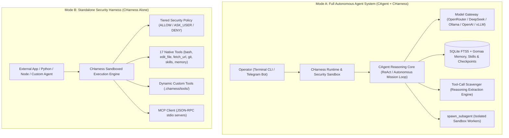
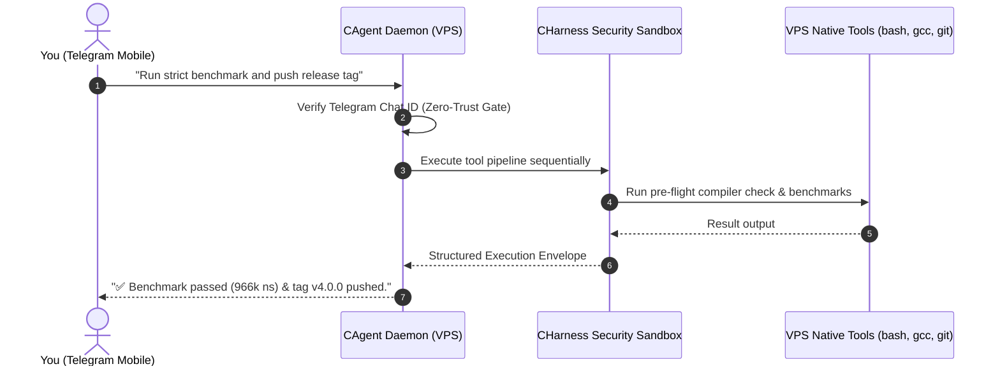

# CHarness & CAgent — High-Performance Autonomous C Agent & Security Execution Sandbox

[](https://github.com/M4F-S/CHarness/releases/tag/v4.0.0)
[](LICENSE)
[]()
[-brightgreen.svg)]()
[]()

A high-performance, zero-dependency autonomous AI agent and security execution harness implemented in pure C99. Designed for sub-millisecond execution, complete local privacy, low-level POSIX execution safety, Model Context Protocol (MCP) tool extensibility, dynamic self-tooling, multi-session checkpointing, pre-flight compiler auto-healing, Gomaa memory scoping, tool-call scavenging, 3-zone prompt caching, procedural skills curation, instant Git rollback, historical conversation search, multi-method REST API requests, and 24/7 VPS Telegram Bot remote control.

---

## Table of Contents
- [Architectural Overview](#architectural-overview)
- [Key Capabilities & Evolution 4.0 Innovations](#key-capabilities--evolution-40-innovations)
- [Installation & Quick Start](#installation--quick-start)
  - [Prerequisites](#prerequisites)
  - [Build Instructions](#build-instructions)
- [Operating Modes](#operating-modes)
  - [Mode 1: Terminal Interactive CLI (Local AI Engineer)](#mode-1-terminal-interactive-cli-local-ai-engineer)
  - [Mode 2: 24/7 VPS Telegram Bot Daemon](#mode-2-247-vps-telegram-bot-daemon)
  - [Mode 3: Standalone Security Execution Sandbox](#mode-3-standalone-security-execution-sandbox)
- [Native Tool Suite (17 Built-In Tools)](#native-tool-suite-17-built-in-tools)
- [Command & Slash Controls Reference](#command--slash-controls-reference)
- [Core Architectural Subsystems](#core-architectural-subsystems)
  - [1. Tool-Call Scavenger Engine](#1-tool-call-scavenger-engine)
  - [2. Pre-Flight Compiler Watchdog & Auto-Healing](#2-pre-flight-compiler-watchdog--auto-healing)
  - [3. Gomaa Memory Paradigm & Scoping](#3-gomaa-memory-paradigm--scoping)
  - [4. Dynamic Self-Tooling & Parameter Contracts](#4-dynamic-self-tooling--parameter-contracts)
  - [5. Subagent Delegation & Structured Envelopes](#5-subagent-delegation--structured-envelopes)
  - [6. 3-Zone Prefix Caching & Economics](#6-3-zone-prefix-caching--economics)
- [Automated Test Suite (20/20 Stress Tests)](#automated-test-suite-2020-stress-tests)
- [License](#license)

---

## Architectural Overview

CHarness and CAgent feature a clean **Brain & Sandbox** separation. You can run them **together as an autonomous software engineer** or use **CHarness alone as a standalone security execution runtime** for any external agent or application.



---

## Key Capabilities & Evolution 4.0 Innovations

- **Zero Heavy Dependencies:** Pure C99, POSIX, `libcurl`, and `sqlite3`. No Node.js, Python, or npm runtimes required (<8MB RAM footprint).
- **Tool-Call Scavenger Engine (Always-On):** Robust extraction of JSON tool calls embedded within `<think>` reasoning traces, `<tool_call>` XML tags, or markdown code blocks from frontier reasoning models (DeepSeek-R1, Qwen-2.5, Hermes) with brace-depth balancing and whitelist validation.
- **Autonomous Multi-Step Mission Loop:** Continuous multi-stage execution without intermediate pauses. The harness automatically tracks active missions and continues driving tool calls until the final consolidated report is generated.
- **Pre-Flight Compiler Watchdog & Auto-Healing:** `write_file`, `edit_file`, and `apply_patch` automatically run pre-flight syntax checks on C/C++ files (`gcc -fsyntax-only`). Supports `"verify_compile": true` with automatic revert if compilation fails.
- **Structured Subagent Execution Envelopes:** `spawn_subagent` captures and returns full execution envelopes (task, tool execution traces with stdout/stderr, and final output).
- **Explicit Parameter Contract for Dynamic Tools:** `define_tool` maps parameters across multiple deterministic channels: `$PARAM_<KEY>`, `$ARG_<KEY>`, positional `$1`/`$2`, `stdin`, and `$TOOL_ARGS_JSON`.
- **Gomaa Memory Paradigm (Wing/Room Scoping & Deduplication):**
  - **Wing & Room Scoping:** SQLite-backed memory with domain isolation (`wing/room: topic`), e.g. `backend/auth`, `concurrency/lockfree`, `skills/git`.
  - **Salience Scoring & Recency Boost:** Recalled memories automatically have their salience increased and access frequency updated.
  - **FTS5 Sanitization & Deduplication:** Queries sanitize delimiters (`:`, `/`) to prevent syntax errors; query results use `GROUP BY` deduplication to prevent repeated entries.
  - **Persistent Timeline Logging:** Chronological event timeline recording tool executions, memory writes, compactions, and session checkpoints (`/timeline [N]`).
- **3-Zone Prefix Cache Invariant & Economics:** Strict byte-locked Zone 1 pinned prefix (system prompt + skills manifest), Zone 2 append-only history log, and Zone 3 ephemeral skill guidance injection for 90%+ prompt cache hit rates. Real-time cache economics tracking via `/cache`.
- **Git State Checkpoints & Instant Rollback:** Automated per-turn commit snapshots and manual checkpointing (`c_agent_create_checkpoint`, `/checkpoint [id]`, `/rollback [id]`) restoring workspace files and conversation context instantly.
- **Fine-Tuning Trajectory Exporter:** Export complete multi-turn conversations and tool execution trajectories into standard OpenAI fine-tune JSONL format (`/export [session_id] [file]`).
- **24/7 VPS Telegram Bot Daemon:** Control your autonomous AI engineer from your phone with a **Zero-Trust Security Gate** (only your Chat ID is accepted), real-time streaming, typing indicators, and session management (`/reset`, `/clear`, `/new`, `/compact`).

---

## Installation & Quick Start

### Prerequisites

#### Ubuntu / Debian:
```bash
sudo apt-get update && sudo apt-get install -y build-essential libcurl4-openssl-dev libsqlite3-dev git
```

#### macOS (Homebrew):
```bash
brew install curl sqlite3
```

---

### Build Instructions

```bash
# 1. Clone the repository
git clone https://github.com/M4F-S/CHarness.git
cd CHarness

# 2. Build the self-contained executable
make

# 3. Run the automated 20/20 test suite
make test
```

This compiles the single standalone binary: `./c_agent_system` (~130KB binary size).

---

## Operating Modes

### Mode 1: Terminal Interactive CLI (Local AI Engineer)

Use this mode for local development, code authoring, and interactive pair-programming in your terminal.

#### 1. Set Your Model Backend

**Option A — Cloud Providers (OpenRouter / DeepSeek / OpenAI):**
```bash
export MODEL_ENDPOINT="https://openrouter.ai/api/v1/chat/completions"
export MODEL_NAME="deepseek/deepseek-v4-flash"
export MODEL_API_KEY="sk-or-v1-your-api-key"
```

**Option B — Local Offline LLMs (Ollama / vLLM / llama.cpp):**
```bash
export MODEL_ENDPOINT="http://localhost:11434/v1/chat/completions"
export MODEL_NAME="deepseek-r1:14b"
export MODEL_API_KEY="none"
```

#### 2. Start the Agent
```bash
./c_agent_system
```

#### 3. Interacting with the Agent
Type your request in natural language. The agent will read files, execute shell commands, edit code, auto-heal compiler warnings, and report results:
```text
charness [1 msgs | 67 toks]> Create a lock-free SPSC ring buffer in pure C99 and benchmark it.
```

---

### Mode 2: 24/7 VPS Telegram Bot Daemon

Run CAgent as a persistent background daemon on your VPS to manage servers, audit infrastructure, and develop software remotely from Telegram.



#### 1. Obtain Bot Credentials
1. Message [@BotFather](https://t.me/botfather) on Telegram: send `/newbot` to obtain your `TELEGRAM_BOT_TOKEN`.
2. Message [@userinfobot](https://t.me/userinfobot) to get your personal numeric `TELEGRAM_CHAT_ID`.

#### 2. Configure Environment (`.env`)
```bash
cp .env.example .env
nano .env
```
Fill in your configuration:
```env
MODEL_ENDPOINT=https://openrouter.ai/api/v1/chat/completions
MODEL_NAME=deepseek/deepseek-v4-flash
MODEL_API_KEY=sk-or-v1-your-key-here

TELEGRAM_BOT_TOKEN=123456789:ABCDefGhIJKlmNoPQRsTUVwxyZ
TELEGRAM_CHAT_ID=7934918808
```

#### 3. Run as a Systemd Service (Auto-restart on boot)
```bash
sudo cp charness.service /etc/systemd/system/
sudo systemctl daemon-reload
sudo systemctl enable --now charness
```

Check status or stream live logs anytime:
```bash
sudo systemctl status charness
sudo journalctl -u charness -f
```

---

### Mode 3: Standalone Security Execution Sandbox

Use `CHarness` purely as an embedded C99 execution engine for external agents, scripts, or Python/Node runtimes.

```c
#include "c_harness.h"

int main(void) {
    // Initialize standalone sandbox without an LLM
    CHarness *h = c_harness_init(NULL);

    // Prepare tool arguments
    JsonValue *args = json_create_object();
    json_obj_add(args, "command", json_create_string("git status -s"));

    // Execute bash inside security sandbox
    for (size_t i = 0; i < h->tool_count; i++) {
        if (strcmp(h->tools[i].name, "bash") == 0) {
            char *result = h->tools[i].callback(NULL, args);
            printf("Sandbox Output:\n%s\n", result);
            free(result);
            break;
        }
    }

    json_free(args);
    c_harness_free(h);
    return 0;
}
```

---

## Native Tool Suite (17 Built-In Tools)

| Tool Name | Parameters | Description |
|:---|:---|:---|
| **`bash`** | `command` (str) | Executes shell commands with persistent CWD tracking & timeout protection |
| **`read_file`** | `path` (str), `offset` (num), `limit` (num) | Reads file contents with line-number slicing |
| **`write_file`** | `path` (str), `content` (str) | Writes text directly to disk with pre-flight compiler syntax check |
| **`edit_file`** | `path`, `old_text`, `new_text`, `verify_compile` (bool) | Exact search-and-replace edit with optional compile-verify guard and auto-revert |
| **`apply_patch`** | `path` (str), `patch` (str) | Multi-hunk structured replacement patch engine (`<<<<<<< SEARCH ... ======= ... >>>>>>> REPLACE`) |
| **`list_dir`** | `path` (str) | Inspects directory contents |
| **`search_files`** | `pattern` (str), `path` (str), `file_glob` (str) | Recursively searches text patterns across codebase files (grep-like) |
| **`git_status`** | *(none)* | Inspects Git working copy status |
| **`git_diff`** | `staged` (bool), `path` (str) | Inspects staged or unstaged Git diffs |
| **`save_memory`** | `topic` (str), `content` (str) | Stores verified knowledge into SQLite persistent memory with wing/room scoping |
| **`recall_memory`** | `query` (str) | Searches SQLite memory using sanitized FTS5 queries, BM25 ranking, and query deduplication |
| **`save_skill`** | `name` (str), `trigger` (str), `description` (str), `instructions` (str) | Distills and indexes reusable procedural skills with automatic deduplication |
| **`recall_skill`** | `query` (str) | Retrieves curated procedural skills with progressive disclosure |
| **`recall_conversation`** | `query` (str) | Searches historical conversation sessions and timestamps in SQLite |
| **`fetch_url`** | `url` (str), `method` (str), `headers` (obj), `body` (str) | Native HTTP/REST client supporting GET, POST, PUT, DELETE, custom headers, and payloads |
| **`spawn_subagent`**| `task` (str), `instructions` (str), `max_turns` (num) | Spawns isolated worker subagent and returns structured execution envelope |
| **`define_tool`** | `name`, `description`, `parameters`, `script_body` | Dynamically creates, scripts, persists, and registers new executable tools with full parameter contracts |

---

## Command & Slash Controls Reference

| Command | Interface | Description |
|:---|:---|:---|
| `/help` | CLI & Telegram | Show command reference |
| `/status` | CLI & Telegram | View active model, endpoint, token usage, CWD, and session count |
| `/tools` | CLI & Telegram | Show all registered tools (including dynamic MCP & custom tools) |
| `/reset` *(or `/clear`, `/new`)* | CLI & Telegram | **Reset session history** (preserves system directives and persistent SQLite memory) |
| `/compact [N]` | CLI & Telegram | Prune older messages, keeping `N` recent turns |
| `/skills` | CLI & Telegram | View all curated procedural skills in the persistent registry |
| `/cache` | CLI & Telegram | Inspect 3-zone prompt cache hit rates and token savings |
| `/timeline [N]` | CLI & Telegram | View recent Gomaa chronological timeline event log |
| `/rules` | CLI & Telegram | View active repository guidelines (`.agentrules` / `AGENTS.md`) |
| `/sessions` | CLI & Telegram | List all saved conversation sessions in SQLite |
| `/save [id]` | CLI & Telegram | Checkpoint current conversation tree to database |
| `/resume <id>` | CLI & Telegram | Restore past conversation session by ID |
| `/reflect` | CLI & Telegram | Distill recent trajectory into reusable SQLite skill |
| `/export <session_id> <file>` | CLI & Telegram | Export session trajectory to OpenAI fine-tune JSONL format |
| `/checkpoint [id]` | CLI & Telegram | Create instant Git & SQLite state checkpoint |
| `/rollback <id>` | CLI & Telegram | Rollback workspace files and context to a past checkpoint |
| `/model <name>` | CLI & Telegram | Switch active AI model dynamically |
| `/cwd [path]` | CLI & Telegram | View or change current working directory |
| `/mcp <cmd>` | CLI & Telegram | Connect to an external stdio MCP server |

---

## Core Architectural Subsystems

### 1. Tool-Call Scavenger Engine
Frontier reasoning models (like DeepSeek-R1) often output tool invocations directly within `<think>` reasoning traces or markdown code blocks without setting formal tool-call flags. The scavenger engine scans model responses with balanced-brace parsing, validates tool names against the active registry, parses arguments safely, and invokes tools seamlessly.

### 2. Pre-Flight Compiler Watchdog & Auto-Healing
Whenever `write_file`, `edit_file`, or `apply_patch` modifies a `.c`, `.h`, `.cpp`, or `.cc` file, CHarness runs `gcc -fsyntax-only` in the background. If syntax errors exist, structured compiler diagnostics are returned directly to the agent. When `verify_compile: true` is passed, failing edits are **automatically reverted** to preserve file integrity.

### 3. Gomaa Memory Paradigm & Scoping
- **Scoped Wings & Rooms:** Knowledge is organized under domain paths (`wing/room: topic`), preventing context pollution.
- **FTS5 Sanitization:** Special SQLite query operators (`:`, `/`, `*`) are sanitized to guarantee syntax safety.
- **Query-Level Deduplication:** `GROUP BY` aggregation ensures queries return only unique, highest-salience knowledge entries.
- **Salience & Recency:** Recalled memories receive an automatic salience boost.

### 4. Dynamic Self-Tooling & Parameter Contracts
When the agent creates a custom tool via `define_tool`, the script is stored in `.charness/tools/` and registered dynamically. The execution runner provides an explicit parameter contract:
- **Environment Variables:** `$PARAM_<KEY>` and `$ARG_<KEY>` (e.g. `$PARAM_INPUT`).
- **Positional Arguments:** `$1` (primary input) and `$2` (raw JSON arguments).
- **Standard Input (`stdin`):** Streamed JSON payload.
- **Global Environment:** `$TOOL_ARGS_JSON`.

### 5. Subagent Delegation & Structured Envelopes
Subagents run in isolated sandbox instances with their own memory and tool sets. The parent agent receives a complete structured execution envelope containing:
- Assigned Task
- Tools Executed with Arguments & Outputs (stdout/stderr)
- Final Answer & Summary

### 6. 3-Zone Prefix Caching & Economics
To maximize prompt cache hits across modern LLM providers:
- **Zone 1 (Pinned Prefix):** Static system prompt + compact skills manifest (byte-locked for 90%+ cache hits).
- **Zone 2 (Append-Only History):** Chronological conversation messages and tool observations.
- **Zone 3 (Ephemeral Context):** On-demand skill instructions injected only when triggers are matched.

---

## Automated Test Suite (20/20 Stress Tests)

Run the comprehensive test suite locally or on your server:
```bash
make test
```

```text
================ Running CHarness & CAgent Super Strict Test Suite ================
[Test] DynString Operations...
  -> DynString PASSED
[Test] MiniJSON Parser & Serializer...
  -> MiniJSON PASSED
[Test] BPE-calibrated Token Estimator...
  -> Token Estimator PASSED (Total: 341 tokens)
[Test] Agent Memory (FTS5) & Rules Auto-Discovery...
  -> Agent Memory & Rules PASSED
[Test] Session Checkpointing & Resumption...
  -> Session Checkpointing & Resumption PASSED
[Test] Dynamic Self-Tooling (define_tool & Custom Script Execution)...
  -> Dynamic Self-Tooling PASSED
[Test] Harness Tool Suite (13 Tools) & Patch Engine...
  -> Harness Tools & Patch Engine PASSED
[Test] Telegram Bot Adapter Security & Setup...
  -> Telegram Adapter PASSED
[Test] Pre-Flight Compiler Watchdog (Auto-Healing Feedback Loop)...
  -> Pre-Flight Compiler Watchdog PASSED
[Test] Native Web Content Retrieval (fetch_url)...
  -> fetch_url Tool PASSED
[Test] Gomaa Memory Paradigm (Wing/Room Scoping, Salience & Timeline)...
  -> Gomaa Memory & Timeline PASSED
[Test] Tool-Call Scavenger Engine (DeepSeek/Reasoning Extraction)...
  -> Tool-Call Scavenger PASSED
[Test] Skills Curation & Progressive Disclosure Loop...
  -> Skills Curation & Progressive Disclosure PASSED
[Test] Git & State Checkpoint and Instant Rollback...
  -> Git Checkpointing & Instant Rollback PASSED
[Test] Trajectory Exporter (OpenAI Fine-Tune JSONL Format)...
  -> Trajectory Exporter PASSED
[Test] Historical Conversation Search & Multi-Method REST Retrieval...
  -> Historical Conversation Search PASSED
[Test] Advanced REST Client (Multi-Method, Headers, JSON Body)...
  -> Advanced REST Client PASSED
[Test] Tool-Call Scavenger Deep Stress & Edge-Case Parser...
  -> Tool-Call Scavenger Deep Stress PASSED
[Test] Multi-Turn Checkpointing & Rollback State Machine...
  -> Multi-Turn Checkpointing & Rollback PASSED
[Test] Progressive Disclosure Manifest & Salience Priority...
  -> Progressive Disclosure Manifest PASSED
================ All Tests Passed Successfully (20/20 - 100%) ================
```

---

## License

Licensed under the Apache License, Version 2.0 (the "License"); you may not use this file except in compliance with the License. You may obtain a copy of the License at:

[http://www.apache.org/licenses/LICENSE-2.0](http://www.apache.org/licenses/LICENSE-2.0)

Unless required by applicable law or agreed to in writing, software distributed under the License is distributed on an "AS IS" BASIS, WITHOUT WARRANTIES OR CONDITIONS OF ANY KIND, either express or implied. See the License for the specific language governing permissions and limitations under the License.

