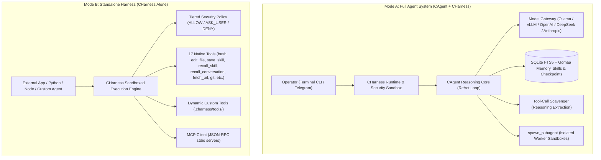
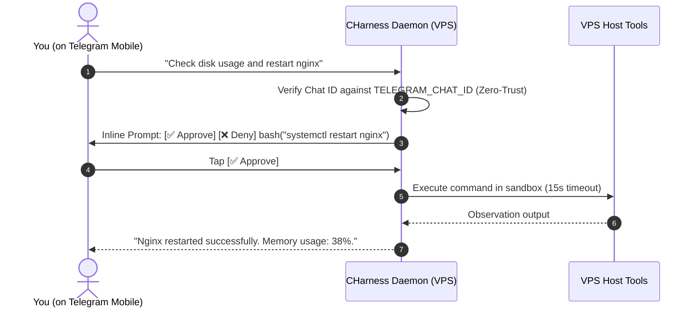

# CHarness & CAgent — High-Performance Autonomous C Agent & Security Execution Sandbox

[](https://github.com/M4F-S/CHarness/releases/tag/v4.0.0)
[](LICENSE)
[]()
[-brightgreen.svg)]()

A high-performance, zero-dependency autonomous AI agent and security execution harness implemented in pure C99. Designed for sub-millisecond execution, complete local privacy, low-level POSIX execution safety, Model Context Protocol (MCP) tool extensibility, dynamic self-tooling, multi-session checkpointing, pre-flight compiler auto-healing, Gomaa memory scoping, tool-call scavenging, 3-zone prompt caching, procedural skills curation, instant Git rollback, historical conversation search, multi-method REST API requests, and 24/7 VPS Telegram Bot remote control.

---

## Architectural Overview

CHarness and CAgent feature a clean **Brain & Sandbox** separation. You can run them **together as an autonomous software engineer** or use **CHarness alone as a standalone security execution runtime** for any external agent or application.



---

## Key Capabilities & Evolution 4.0 Innovations

- **Tool-Call Scavenger Engine (Always-On):** Robust extraction of JSON tool calls embedded within `<think>` reasoning traces, `<tool_call>` XML tags, or markdown code fences from reasoning models (DeepSeek-R1, Qwen-2.5, Hermes) with brace-depth balancing and whitelist validation.
- **3-Zone Prefix Cache Invariant & Economics:** Strict byte-locked Zone 1 pinned prefix (system prompt + skills manifest), Zone 2 append-only history log, and Zone 3 ephemeral skill guidance injection for 90%+ prompt cache hit rates. Real-time cache economics tracking via `/cache`.
- **Closed Skill Curation Loop & Progressive Disclosure:** High-level procedural skills saved to SQLite (`save_skill`, `/skills`) with compact 1-line manifest disclosure in Zone 1, and automated on-demand trigger matching to inject full instructions only when needed.
- **Git State Checkpoints & Instant Rollback:** Automated per-turn commit snapshots and manual checkpointing (`c_agent_create_checkpoint`, `/checkpoint [id]`, `/rollback [id]`) restoring workspace files and conversation context instantly.
- **Fine-Tuning Trajectory Exporter:** Export complete multi-turn conversations and tool execution trajectories into standard OpenAI fine-tune JSONL format (`/export [session_id] [file]`).
- **Disambiguated `edit_file` Safety:** Content-anchored search-and-replace now detects duplicate matches across a file and returns exact line numbers for disambiguation.
- **Pre-Flight Compiler Watchdog (Auto-Healing Loop):** `write_file`, `edit_file`, and `apply_patch` automatically run pre-flight syntax checks on C/C++ files (`gcc -fsyntax-only`), returning compiler warnings directly to the model for immediate self-correction.
- **Gomaa Memory Architecture (Slim C99 Paradigm):**
  - **Wing & Room Scoping:** SQLite-backed memory with domain isolation (`wing/room: topic`), e.g. `backend/auth`, `devops/ci`, `skills/git`.
  - **Salience Scoring & Recency Boost:** Recalled memories and skills automatically have their salience increased and access frequency updated.
  - **Persistent Timeline Logging:** Chronological event timeline recording tool executions, memory writes, compactions, and session checkpoints queryable via `/timeline [N]`.
- **Zero Heavy Dependencies:** Pure C99, POSIX, `libcurl`, and `sqlite3`. No Node.js, Python, or npm runtimes required (<8MB RAM footprint).
- **24/7 VPS Telegram Bot Daemon:** Control your autonomous AI engineer from your phone with a **Zero-Trust Security Gate** (only your Chat ID is accepted) and **Interactive Inline Approval Buttons** (`[ ✅ Approve ]` / `[ ❌ Deny ]`).

---

## Step-by-Step Beginner's Guide

### Prerequisites & Quick Build

#### 1. Install System Dependencies
- **Ubuntu / Debian:**
  ```bash
  sudo apt-get update && sudo apt-get install -y build-essential libcurl4-openssl-dev libsqlite3-dev
  ```
- **macOS:**
  ```bash
  brew install curl sqlite3
  ```

#### 2. Clone & Build
```bash
git clone https://github.com/M4F-S/CHarness.git
cd CHarness
make
```
This builds the single self-contained executable: `./c_agent_system`.

---

### Mode 1: Full Autonomous AI Agent (Terminal CLI)

Use this mode for local interactive coding and development in your terminal.

#### Step 1: Set Your LLM Backend

**Option A — Local Offline LLM (Ollama / vLLM / llama.cpp):**
```bash
export MODEL_ENDPOINT="http://localhost:11434/v1/chat/completions"
export MODEL_NAME="hermes-3"
export MODEL_API_KEY="none"
```

**Option B — Cloud Provider (OpenAI / Groq / OpenRouter / DeepSeek):**
```bash
export MODEL_ENDPOINT="https://api.openai.com/v1/chat/completions"
export MODEL_NAME="gpt-4o"
export MODEL_API_KEY="sk-your-api-key-here"
```

#### Step 2: Start the Agent
```bash
./c_agent_system
```

#### Step 3: Interact with the Agent
Type your request in plain English. The agent will autonomously read files, execute shell commands, edit code, and verify its work:
```
charness [1 msgs | 67 toks]> Inspect the Makefile and optimize compiler flags for C99
```

**Helpful Slash Commands in CLI:**
- `/help` — Show command reference
- `/status` — View active model, endpoint, token usage, and working directory
- `/tools` — List all registered tools and permissions
- `/timeline [N]` — View recent Gomaa timeline event log
- `/save my_work` — Checkpoint your current conversation to SQLite
- `/sessions` — List all saved sessions
- `/resume my_work` — Resume a saved session
- `/reflect` — Distill recent task steps into persistent memory
- `/compact [N]` — Prune older conversation turns to conserve token budget
- `/memory [query]` — Query SQLite persistent memory directly

---

### Mode 2: 24/7 VPS Telegram Bot (Remote AI Engineer)

Use this mode to run the agent as a continuous daemon on your VPS, allowing you to command it and approve sensitive actions directly from your phone.



#### Step 1: Create a Telegram Bot & Get Your Chat ID
1. Open Telegram and message [@BotFather](https://t.me/botfather). Send `/newbot` to get your **`TELEGRAM_BOT_TOKEN`**.
2. Message [@userinfobot](https://t.me/userinfobot) to get your personal numeric **`TELEGRAM_CHAT_ID`** (e.g. `987654321`).

#### Step 2: Configure `.env`
```bash
cp .env.example .env
nano .env
```
Fill in your configuration:
```env
MODEL_ENDPOINT=https://api.deepseek.com/v1/chat/completions
MODEL_NAME=deepseek-chat
MODEL_API_KEY=sk-your-api-key-here

TELEGRAM_BOT_TOKEN=123456789:ABCDefGhIJKlmNoPQRsTUVwxyZ
TELEGRAM_CHAT_ID=987654321
```

#### Step 3: Run Interactive or as a 24/7 Background Service

- **Run in Foreground:**
  ```bash
  source .env && ./c_agent_system --telegram
  ```

- **Run as a 24/7 Systemd Service (Auto-restart on boot):**
  ```bash
  sudo mkdir -p /opt/charness
  sudo cp -r . /opt/charness/
  sudo cp charness.service /etc/systemd/system/
  sudo systemctl daemon-reload
  sudo systemctl enable --now charness
  ```

Check status anytime:
```bash
sudo systemctl status charness
sudo journalctl -u charness -f
```

---

### Mode 3: Standalone Security Execution Sandbox (CHarness Alone)

Use `CHarness` purely as an embedded C99 execution sandbox for external agents, scripts, or custom applications.

`CHarness` provides:
- Non-blocking subprocess execution with **configurable timeouts** (`BASH_TIMEOUT`, default: 30s) and automatic hung process termination.
- Persistent working directory (`cwd`) tracking.
- Multi-hunk structured patch application (`apply_patch`).
- Automated pre-flight syntax verification (`gcc -fsyntax-only`).
- Tiered security policies (`PERM_ALLOW`, `PERM_ASK_USER`, `PERM_DENY`).
- Dynamic MCP stdio proxying.

#### Example C Code (`standalone_example.c`):
```c
#include "c_harness.h"

int main(void) {
    // 1. Initialize standalone harness without an active LLM
    CHarness *h = c_harness_init(NULL);

    // 2. Prepare tool arguments
    JsonValue *args = json_create_object();
    json_obj_add(args, "command", json_create_string("git status -s"));

    // 3. Execute 'bash' tool inside the security sandbox
    for (size_t i = 0; i < h->tool_count; i++) {
        if (strcmp(h->tools[i].name, "bash") == 0) {
            char *result = h->tools[i].callback(NULL, args);
            printf("Sandbox Output:\n%s\n", result);
            free(result);
            break;
        }
    }

    json_free(args);
    c_harness_free(h);
    return 0;
}
```

Compile and run:
```bash
gcc -Wall -O2 standalone_example.c linenoise.c minijson.c mcp_client.c model_adapter.c c_agent.c c_harness.c telegram_adapter.c -lcurl -lsqlite3 -o standalone_example
./standalone_example
```

---

## Native Tool Suite Reference (14 Tools)

| Tool Name | Security Gate | Parameters | Description |
|:---|:---|:---|:---|
| **`bash`** | `ASK_USER` | `command` (string) | Executes shell commands with persistent CWD tracking & timeout protection |
| **`read_file`** | `ALLOW` | `path` (string), `offset` (num), `limit` (num) | Reads file contents with optional line-range slicing |
| **`write_file`** | `ASK_USER` | `path` (string), `content` (string) | Writes text content directly to disk with pre-flight compiler check |
| **`edit_file`** | `ASK_USER` | `path`, `old_text`, `new_text` | Exact search-and-replace snippet modifications with auto-healing check |
| **`apply_patch`** | `ASK_USER` | `path`, `patch` | Multi-hunk structured replacement patch engine (`<<<<<<< SEARCH ... ======= ... >>>>>>> REPLACE`) |
| **`fetch_url`** | `ALLOW` | `url` (string) | Direct HTTP GET web retrieval with automatic redirects and buffer protection |
| **`list_dir`** | `ALLOW` | `path` (string) | Inspects directory contents |
| **`search_files`** | `ALLOW` | `pattern`, `path`, `file_glob` | Recursively searches text patterns across codebase files (grep-like) |
| **`git_status`** | `ALLOW` | *(none)* | Inspects Git working copy status |
| **`git_diff`** | `ALLOW` | `staged` (bool), `path` (string) | Inspects staged or unstaged Git diffs |
| **`save_memory`** | `ALLOW` | `topic`, `content` | Stores verified knowledge into SQLite persistent memory with wing/room scoping |
| **`recall_memory`** | `ALLOW` | `query` (string) | Searches SQLite memory using FTS5 BM25 ranking and boosts salience |
| **`spawn_subagent`**| `ALLOW` | `task`, `instructions`, `max_turns` | Spawns child autonomous agent in an isolated context |
| **`define_tool`** | `ASK_USER` | `name`, `description`, `parameters`, `script_body` | **Dynamically creates, scripts, persists, and registers a new tool for self-evolution** |

---

## Commands & Slash Controls Reference

| Command | Environment | Description |
|:---|:---|:---|
| `/help` | CLI & Telegram | Display command reference and system status |
| `/status` | CLI & Telegram | View active model, endpoint, token usage, CWD, and session count |
| `/tools` | CLI & Telegram | Show registered tools (including dynamic MCP & custom tools) |
| `/timeline [N]` | CLI & Telegram | View recent Gomaa chronological timeline event log |
| `/rules` | CLI & Telegram | View active repository guidelines (`.agentrules` / `AGENT.md`) |
| `/sessions` | CLI & Telegram | List all checkpointed conversation sessions in SQLite |
| `/save [id]` | CLI & Telegram | Checkpoint current conversation tree to database |
| `/resume <id>` | CLI & Telegram | Restore past conversation session by ID |
| `/reflect` | CLI & Telegram | Distill recent trajectory into a reusable SQLite FTS5 skill |
| `/clear` | CLI & Telegram | Reset conversation history (preserves system instructions) |
| `/compact [N]` | CLI & Telegram | Prune older messages, keeping `N` recent turns |
| `/memory [q]` | CLI & Telegram | Query SQLite persistent memory directly |
| `/model <m>` | CLI & Telegram | Switch active AI model dynamically |
| `/cwd [path]` | CLI & Telegram | View or change current working directory |
| `/mcp <cmd>` | CLI & Telegram | Connect to an external stdio MCP server |
| `exit` | CLI | Terminate the interactive REPL |

---

## Testing & Verification

Run the automated test suite to verify memory safety, tool behavior, session persistence, pre-flight compiler auto-healing, and Gomaa memory scoping:

```bash
make test
```

**Test Output:**
```
================ Running CHarness & CAgent Evolution 3.0 Test Suite ================
[Test] DynString Operations...
  -> DynString PASSED
[Test] MiniJSON Parser & Serializer...
  -> MiniJSON PASSED
[Test] BPE-calibrated Token Estimator...
  -> Token Estimator PASSED (Total: 67 tokens)
[Test] Agent Memory (FTS5) & Rules Auto-Discovery...
  -> Agent Memory & Rules PASSED
[Test] Session Checkpointing & Resumption...
  -> Session Checkpointing & Resumption PASSED
[Test] Dynamic Self-Tooling (define_tool & Custom Script Execution)...
  -> Dynamic Self-Tooling PASSED
[Test] Harness Tool Suite (13 Tools) & Patch Engine...
  -> Harness Tools & Patch Engine PASSED
[Test] Telegram Bot Adapter Security & Setup...
  -> Telegram Adapter PASSED
[Test] Pre-Flight Compiler Watchdog (Auto-Healing Feedback Loop)...
  -> Pre-Flight Compiler Watchdog PASSED
[Test] Native Web Content Retrieval (fetch_url)...
  -> fetch_url Tool PASSED
[Test] Gomaa Memory Paradigm (Wing/Room Scoping, Salience & Timeline)...
  -> Gomaa Memory & Timeline PASSED
================ All Tests Passed Successfully (100%) ================
```

---

## License

Licensed under the Apache License, Version 2.0 (the "License"); you may not use this file except in compliance with the License. You may obtain a copy of the License at:

[http://www.apache.org/licenses/LICENSE-2.0](http://www.apache.org/licenses/LICENSE-2.0)

Unless required by applicable law or agreed to in writing, software distributed under the License is distributed on an "AS IS" BASIS, WITHOUT WARRANTIES OR CONDITIONS OF ANY KIND, either express or implied. See the License for the specific language governing permissions and limitations under the License.
